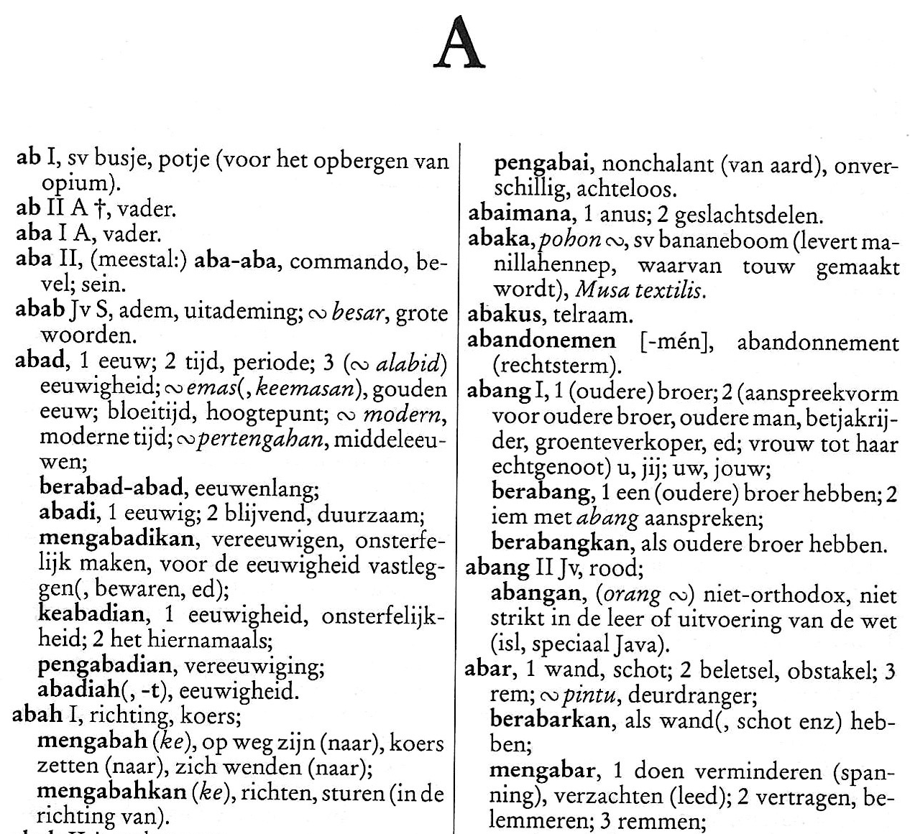
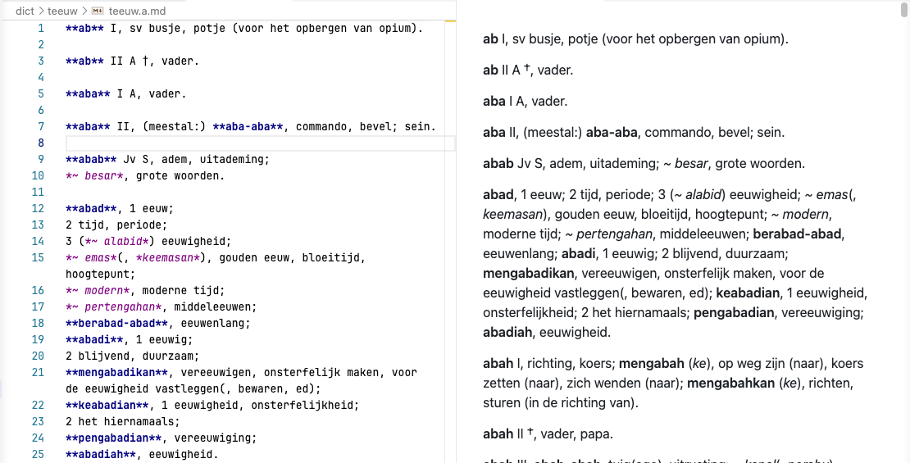
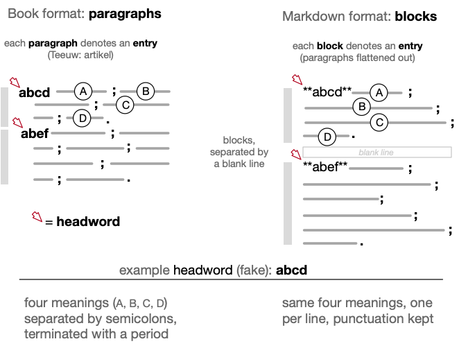
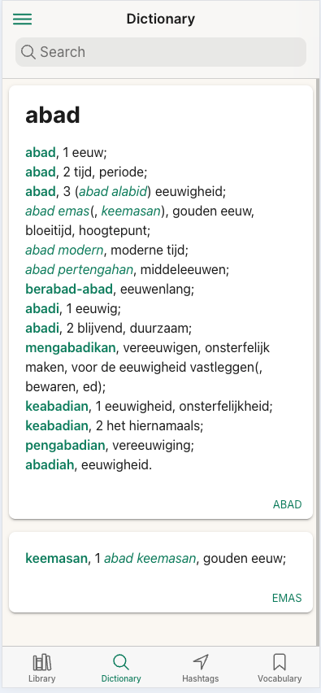

# Teeuw Source Format

This document describes how to read and write the Teeuw dictionary markdown source (`dict/teeuw/*.md`): the markup conventions, what each symbol means, and the rules an editor must
follow so the compiler accepts the file and interprets it correctly.

It serves two purposes:

1. It documents how the author went about producing the markdown source files from OCR scanned pages of the printed dictionary.
2. It serves as a guide for dictionary editors to create a new, updated revision of the Teeuw 1996 edition, assuming it is within their remit.

This is the **print -> markup** companion to the two developer-oriented documents:

- [INTERNALS.md](./INTERNALS.md) — the compile pipeline and the markup table.
- [TEEUW_PARSER.md](./TEEUW_PARSER.md) — exactly how markup becomes the compiled
  JSON (`base` / `keyword` / `homonym`, the Dutch reverse index).

Where those explain how the machine reads the source, this one explains how a
**human** produces it — most concretely, how to add new words in the `teeuw.X+.md`
supplement files so they behave like the rest of the dictionary.

---

## 1. Terminology

Table 1 below establishes the terminology that will be used throughout the remainder of the document. The same handful of things go by different names depending on whether you mean
Teeuw's printed page, standard lexicography, or this markup. They line up like this:

| Teeuw (Dutch) | Standard (English) | In this markup |
| --- | --- | --- |
| _artikel_ | article / entry | a **block** — one hanging-indent paragraph (compiles to the rows sharing one `base`) |
| _grondwoord_, _hoofdtrefwoord_ | headword (a base) | the **first bold** word of a block → `base` |
| _afleiding_ | derivation, sublemma | a **later bold** word → `keyword` |
| _samenstelling_, _vaste verbinding_ | compound, fixed expression | _italic_; or **bold** on its own line if it has its own derivation |
| _voorbeeld_ | usage (example) | an Indonesian word or phrase used inside a gloss (_italic_) |
| _verwijzing_ (_verwijspijl_ →) | cross-reference | the bold words after a `->` arrow |
| (genummerde)<br />_betekenis(variant)_ | sense | a sense number `1`, `2`, … |

**Table 1.** Terminology: one set of things, three vocabularies (Teeuw's print, standard lexicography, and this markup).

---

## 2. What the source actually is

The markdown is a faithful, human-readable transcription of the printed Teeuw (ref. Figure 1),
encoding its **typography and layout**, while fully retaining its meaning.



**Figure 1.** The first page of the printed Teeuw definitions.

The markdown format (ref. Figure 2) follows closely the format of the printed book. This was for convenience, because the "raw material" for the transcription, viz. hanging paragraphs in scanned OCR pages, could then simply be "flattened out" and marked up with markdown bold and italic annotations[^1]. The markdown could be previewed in the editor with some bold and italic renderings.



**Figure 2.** Book paragraphs from Figure 1 flattened to markdown, shown in text editor.

In printed Teeuw, a headword is bold and
at the left margin; its derivations are bold and indented; its compounds and
usages are italic; the swung dash (the `~` character on your keyboard) stands
in for a repeated word. The markdown source
re-encodes those visual conventions in plain text, and the compiler then derives
all the structure (what is a headword, a derivation, a homonym) **mechanically**
from that typography. See [TEEUW_PARSER.md Part 1](./TEEUW_PARSER.md#part-1--markdown-to-json-headwords-keywords-homonyms).

Two consequences worth internalising:

- **The transcription is based on appearance, not linguistics.** When transcribing from paper to markdown you never have to decide
  "is this a derivation?" You just reproduce what the page shows (bold / italic /
  indentation / swung dash) and the parser does the rest. The one place this
  breaks down is the tilde, which is why [section 6](#6-the--tilde-and-the--revert-marker)
  is the longest.
- For the benefit of both editor and printer, Teeuw used the swung dash as a placeholder for the most recent headword or derivation. In the markdown files, this is replaced by a tilde `~` character, conveniently available on all computer keyboards. From this point on we will refer to the "swung dash" as "tilde". Note that the Taalwiz app never displays the tilde. It is internally replaced with the corresponding headword or derivation. Screen space is cheap; paper, ink and typesetting are not.

The existing Teeuw digitisation is to be considered **best-effort**. The transcription was careful and the
compiler parsing the markdown is strict, but the original is a large, irregular book, and incidental
deviations remain.

---

## 3. The block rule (this is the backbone)

Each **block** is separated from the next by a **blank line** — a block being the
run of consecutive non-blank lines in between. 

<br />
**Figure 3.** One entry, two forms: a hanging-indent paragraph (book) flattened to a block (markdown).

One block is one dictionary
**entry** — what Teeuw calls an *artikel* (article): a single **headword** and everything
printed beneath it. ("Block" and "entry" name the same unit, source-side and
dictionary-side.) The first bold word of a block is the headword — literally
the word at the *head* of the block (the grondwoord / `base`). Every later bold word in the same block is a **derivation**[^2]
(`keyword`) under that same headword — it does **not** start a new entry.

```
**abad**, 1 eeuw;               <- new block: headword `abad`
*~ pertengahan*, middeleeuwen;  <- still `abad` ("abad pertengahan")
**berabad-abad**, eeuwenlang;   <- still `abad` (a keyword, not a new entry)
...                             <- (more derivations of `abad`, omitted for brevity)
                                <- blank line: next block resets the headword
**abah** I, richting, koers;    <- new block: headword `abah`
```

(This is the top of the **A** page shown in Figure 1: see [`abad`](dict/teeuw/teeuw.a.md)
followed, after a blank line, by [`abah`](dict/teeuw/teeuw.a.md).)

If the same headword reappears in a later block, it becomes the next **homonym**
(`kapan I` / `kapan II` in print). The Roman numerals are just text you copy;
the numbering is computed from the repetition. See [TEEUW_PARSER.md §1.2](./TEEUW_PARSER.md#12-the-algorithm-verified-against-the-source).

### How this maps to the printed page

Look at the **A** page in Figure 1 and the block rule falls straight out of the
layout. On the page, each block (entry / *artikel*) takes the form of one
**hanging-indent paragraph** — that is just its print-layout shape: the headword
hangs out at the **left margin**, and the rest of the article — its numbered
senses, its italic compounds, and its bold derivations — sits in an indented body
beneath it (a line that wraps stays at that indent). The next article begins only
when a headword **drops back to the left margin** and a new paragraph starts.

The markdown (ref. Figure 3) re-encodes that paragraph, and the **blank line is the paragraph
break** — the exact point where the page returns to a flush-left headword:

| On the printed page | In the markdown |
|---------------------|-----------------|
| headword hanging at the left margin (starts the paragraph) | the **first** `**bold**` word of a block |
| bold derivation, in the indented body | a **later** `**bold**` word in the same block |
| italic compound or usage, inline | `*italic*` |
| swung dash repeating the governing word | `~` |
| headword drops back to the left margin (new paragraph) | a **blank line** |

**Table 2.** How each feature of the printed page is encoded in the markdown source.

The markdown encodes two things that are easy to conflate. **Block membership**
fixes the headword: every line in a block shares the block's `base`, and the blank
line is the drop to the next left-margin headword. The **line breaks** are
structural too: each line becomes its own **lemma** — a record in the compiled JSON
(the `^` revert marker is the one exception, emitting nothing). That is why Figure 4
shows one row per source line. So putting each form on its own line is not merely
for editing readability; it is how the entry is split into those per-line records.

What the source does *not* reproduce is the page's line-**wrapping**: where a
printed column runs out mid-entry and wraps to an indented line, the markdown
ignores it. That break is cosmetic; the markdown's own line breaks are not.

Following the same `abad` article one stage further — through the compiler and into
the app — closes the loop (Figure 4):



**Figure 4.** The `abad` article compiled and rendered in the Taalwiz app: the end of
the chain (print → markdown → app).[^3]

---

## 4. Markup vocabulary

| Symbol | Print feature it encodes | Meaning to the compiler |
|--------|--------------------------|-------------------------|
| `**word**` | a bold word (headword or derivation) | searchable Indonesian keyword; first in a block = `base`, later = `keyword` |
| `*word*` | an italic word (compound or usage) | reference form, not independently searchable |
| `~` | the swung dash | shorthand for the current governing bold word (see §6) |
| `^` | (no print equivalent) | revert `~` back to the headword (see §6) |
| `+` | a space inside a multi-word unit you want indexed as one | rendered as a space (`anak+tiri` -> "anak tiri") |
| `-` | a literal hyphen / reduplication | kept as-is (`anak-anak`) |
| `->` | a cross-reference arrow | bold words after it are references, not keywords |
| `_word_` | (editorial) an exotic name in a gloss | skipped: not indexed as a Dutch word (e.g. a Latin plant name) |
| `( )` | an optional word-part, or a descriptive aside | both forms are indexed (long form and short form); see [TEEUW_PARSER.md §1.3](./TEEUW_PARSER.md#13-the-parenthesis-double-pass) |
| `1`, `2` | a sense number | copied literally; continues the current headword's senses |
| blank line | return to the left margin | ends the block, resets the headword |

**Table 3.** The full markup vocabulary: each symbol, the print feature it encodes, and what it means to the compiler.

Unused/free characters in the corpus include `^` (now the revert marker) — do
not introduce other control characters without updating the tokenizer.

---

## 5. Derivations and compounds (how an entry is built)

Within a block, the print lays an article out in a fixed order (Teeuw's
introduction, "Opbouw artikelen en volgorde afleidingen"):

1. the headword and its numbered senses;
2. its **compounds / fixed expressions** (italic, alphabetical by the second word);
3. proverbs;
4. its **derivations** (bold, affixed forms).

A compound that has its **own** derivation is promoted to **bold on its own line**,
its derivation set immediately after it, and then the headword's alphabetical
compound list **resumes**. This promotion is exactly what creates the tilde
subtlety below. (It is also the one common case of a later bold word that is *not*
a derivation — relatively rare, e.g. *terima kasih*.)

---

## 6. The `~` tilde and the `^` revert marker

`~` expands to the **nearest preceding bold word** — the lemma the entry is
currently elaborating. Almost always that is what you want:

- in the headword's compound list, `~` is the headword (`*~ pertengahan*` under
  `abad` is "abad pertengahan");
- under a derivation, `~` is that derivation (`*~ negeri*` under `pengadilan` is
  "pengadilan negeri").

**The one trap.** When a bold compound with its own derivation sits inside the
headword's compound list, it becomes the "nearest bold word", so the lines after
it would wrongly attach to the compound instead of the headword:

```
**anak**, kind;
**anak+tiri**, stiefkind; *menganaktirikan*, ...;   <- `~` now points at "anak tiri"
*~ tunggal*, enig kind;                              <- WANTS "anak tunggal", gets "anak tiri tunggal"
```

`^` fixes this. A `^` **reverts `~` (and bare sense numbers) back to the
headword**, from that point until the next bold word re-anchors it. Place it
where the headword's list **resumes** — that is, **right after the compound's own
derivation**:

```
**anak**, kind;
**anak+tiri**, stiefkind; *menganaktirikan*, ...;
^
*~ tunggal*, enig kind;     <- "anak tunggal" again
*~ yatim*, wees;            <- still "anak"
2 jong (dier);              <- sense 2 of "anak", not of "anak tiri"
```

The same shape, with genuine sub-compounds kept before the `^`:

```
**rumah+sakit**, ziekenhuis;
*~ bersalin*, kraamkliniek;   <- "rumah sakit bersalin" (kept: a hospital)
*~ jiwa*, ...;                <- "rumah sakit jiwa"
*merumahsakitkan*, ...;       <- the compound's derivation
^
*~ setan*, ...;               <- "rumah setan" (the rumah list resumes)
*~ sewa*, huurhuis;
```

### How to write `^`

- On **its own line**, or as a **prefix** on the resuming sublemma; an optional
  space after the prefix is allowed for readability:

  ```
  ^                       (its own line)
  ^*~ setan*, ...         (prefix, no space)
  ^ *~ setan*, ...        (prefix, with space — same effect)
  ```
- It is a **latch**: one `^` covers every following line until the next bold word,
  so you mark only the resume point, not each line.
- It emits no lemma of its own and never appears in the app.
- It errors at compile time if it appears before any headword.

### When you do *not* need a `^`

- A bold compound whose derivation is on its **own line** (`**akal+budi**, ...;
  *berakal budi*, ...;`): the derivation already closes it, so just put the `^`
  after that line. If the derivation is on the **same line** as the compound and
  no sub-compounds intervene, put the `^` (or the resuming lines) right after it.
- A `2 ...` sense that is the **compound's own** second sense
  (`**susah+payah**, 1 ...; 2 ...;`): leave it; it belongs to the compound.
- A line where a following **bold** form already re-anchors `~` (a new derivation):
  no `^` needed.

Deciding sub-compound-vs-headword is the one judgment that can need the printed
page (is `~ jiwa` a "rumah sakit jiwa" or a "rumah jiwa"?). The Dutch gloss
usually settles it ("psychiatrische kliniek" is a hospital), so this is reading
your own translation, not deep Indonesian. When in doubt, you can always avoid
`~` entirely and write the word out in full (`*rumah setan*`); it compiles to the
same result.

---

## 7. Supplement (`+`) files

To add post-1996 words, create/extend `teeuw.X+.md` (e.g. `teeuw.a+.md`) using the
**exact same markup**. The core files stay untouched; everything in a `+` file is
automatically flagged `isSupplement` and rendered distinctly. Homonym numbering
carries across the core/supplement boundary. Full design in
[TEEUW_PARSER.md Part 2](./TEEUW_PARSER.md#part-2--supplement--files).

Practical checklist for a new entry:

1. Start a block with a blank line before it; the headword is the first `**bold**`.
2. Use `*~ x*` for compounds of the headword; spell Dutch glosses plainly.
3. If you add a bold compound with its own derivation and more headword-compounds
   follow it, drop a `^` after the derivation.
4. Mark exotic gloss names with `_..._` so they are not indexed as Dutch.
5. Recompile (`pnpm --filter compiler run build && pnpm --filter compiler run start`).
   The compiler is strict: a malformed block aborts with the line number, so a
   clean compile is your first proofreading pass.

---

## 8. Validation

A clean compile guarantees the markup is well-formed, not that every `~` resolves
as you intended. Two safety nets:

- **The compiler warns** (non-fatally, with a line number) when a `~` binds to a
  multi-word compound **after that compound's own derivation has appeared** — the
  signature of a missing `^`. Watch the compile output; a warning almost always
  means "add a `^` where the headword's list resumes". It does not abort the build.
- For anything subtle, check the affected entry in the JSON (`json/teeuw.X.json`)
  or the app: a resumed line should read "`headword word`", not "`compound word`".

The `^` rule plus this warning cover the systematic cases; a new one can only
arise from a new bold compound you introduce, and the warning will flag it.

[^1]: There was more to it: OCR scanning errors had to be located and corrected too.

[^2]: A derivation is what the user-facing guide calls a **sublemma**; the two
terms are interchangeable — a `keyword` under a `base`.

[^3]: Two things are worth noticing in Figure 4. Each swung dash has been
**expanded to its governing word** (`*~ pertengahan*` → "abad pertengahan",
`*~ emas*` → "abad emas"; see [section 6](#6-the--tilde-and-the--revert-marker)),
and the bold derivations (`berabad-abad`, `abadi`, `mengabadikan`, …) are listed
under the headword. The second card, `keemasan`, is something the **printed page
cannot do**: it surfaces as a backlink because its own entry cross-links to `abad`
in the gloss, so the digital form makes the reference bidirectional.
