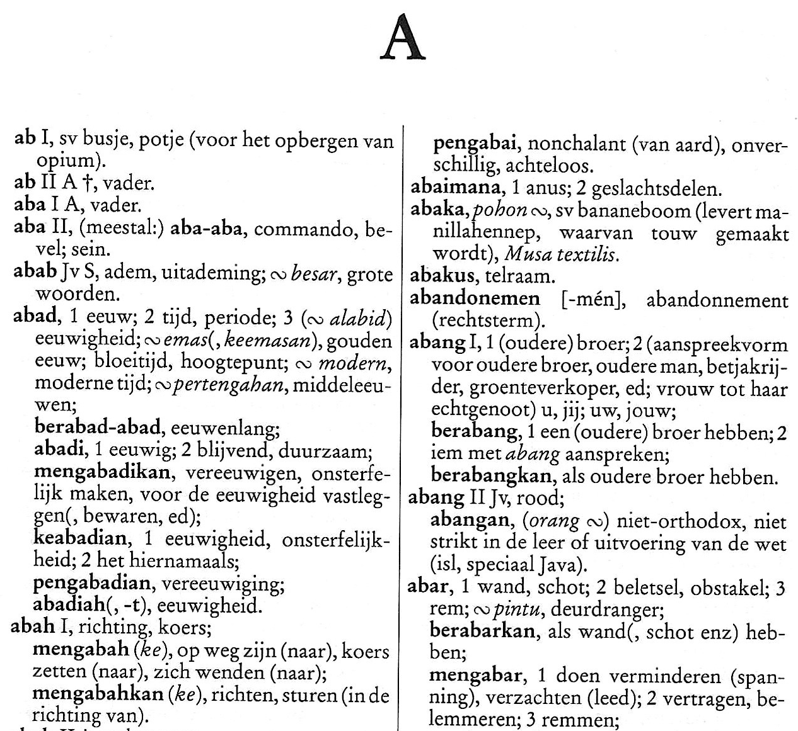
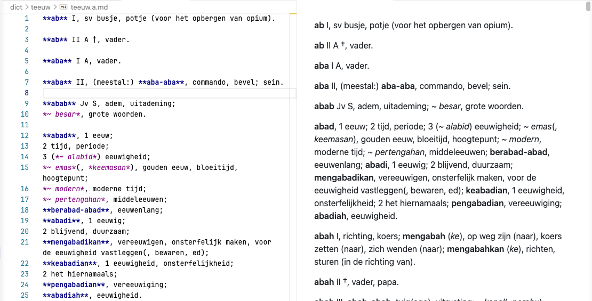
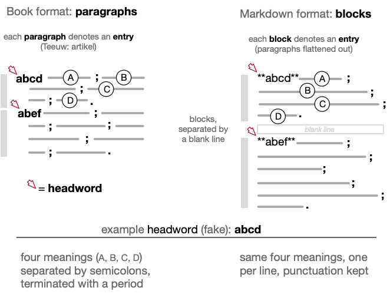
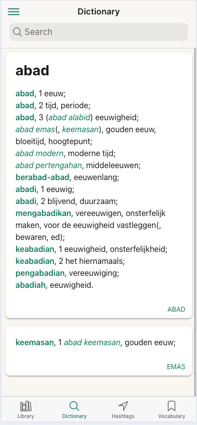

# Teeuw Source Format

This document describes how to read and write the Teeuw dictionary markdown source (`dict/teeuw/*.md`): the markup conventions, what each symbol means, and the rules an editor must
follow so the compiler accepts the file and interprets it correctly.

It serves two purposes:

1. It documents how the author went about producing the markdown source files from OCR scanned pages of the printed dictionary.
2. It serves as a guide for dictionary editors to create a new, updated revision of the Teeuw 1996 edition, assuming it is within their remit.

This is the **print -> markup** companion to the two developer-oriented documents:

- [INTERNALS.md](./INTERNALS.md) — the compile pipeline and the markup table.
- [TEEUW_PARSER.md](./TEEUW_PARSER.md) — exactly how markup becomes the compiled
  JSON (`base` / `keyword` / `homonym`, the Dutch reverse index).

Where those explain how the machine reads the source, this one explains how a
**human** produces it — most concretely, how to add new words in the `teeuw.X+.md`
supplement files so they behave like the rest of the dictionary.

---

## 1. Terminology

Table 1 below establishes the terminology that will be used throughout the remainder of the document. The same handful of things go by different names depending on whether you mean
Teeuw's printed page, standard lexicography, or this markup. They line up like this:

| Teeuw (Dutch) | Standard (English) | In this markup |
| --- | --- | --- |
| _artikel_ | article / entry | a **block** — one hanging-indent paragraph (compiles to the rows sharing one `base`) |
| _grondwoord_, _hoofdtrefwoord_ | headword (a base) | the **first bold** word of a block → `base` |
| _afleiding_ | derivation, sublemma | a **later bold** word → `keyword` |
| _samenstelling_, _vaste verbinding_ | compound, fixed expression | _italic_; or **bold** on its own line if it has its own derivation |
| — (no Teeuw term) | usage (example) | an Indonesian word or phrase used inside a gloss (_italic_) |
| _verwijzing_ (_verwijspijl_ →) | cross-reference | the bold words after a `->` arrow |
| (genummerde)<br />_betekenis(variant)_ | sense | a sense number `1`, `2`, … |

**Table 1.** Terminology: one set of things, three vocabularies (Teeuw's print, standard lexicography, and this markup).

The first two columns probably need no further explanation for readers familiar with the Teeuw dictionary and the standard lexicographical vocabulary. The third column describes the terms used here for the transcription. Their exact meaning will become clearer in the next sections.

---

## 2. What the source actually is

The markdown is a faithful, human-readable transcription of the printed Teeuw (ref. Figure 1),
encoding its **typography and layout**, while fully retaining its meaning.



**Figure 1.** The first page of the printed Teeuw definitions.

The markdown format (ref. Figure 2) follows closely the format of the printed book. This was for convenience, because the "raw material" for the transcription, viz. hanging paragraphs in scanned OCR pages, could then simply be "flattened out" and marked up with markdown bold and italic annotations[^1]. The markdown could be previewed in the editor with the same bold and italic renderings.



**Figure 2.** Book paragraphs from Figure 1 flattened to markdown, shown in the text editor (the author used VS Code).

In printed Teeuw, a headword is bold and
at the left margin; its derivations are bold and indented; its compounds and
usages are italic; the swung dash (the `~` character on your keyboard) stands
in for a repeated word. The markdown source
re-encodes those visual conventions in plain text, and the compiler then derives
all the structure (what is a headword, a derivation, a homonym) **mechanically**
from that typography. See [TEEUW_PARSER.md Part 1](./TEEUW_PARSER.md#part-1--markdown-to-json-headwords-keywords-homonyms).

Two consequences worth internalising:

- **The transcription is based on appearance, not linguistics.** When transcribing from paper to markdown you never have to decide
  "is this a derivation?" You just reproduce what the page shows (bold / italic /
  indentation / swung dash) and the parser does the rest. The one place this
  breaks down is the tilde — the page disambiguates it by *layout*, and the
  markdown block has no layout — which is why
  [section 6](#6-the--tilde-and-the--headword-placeholder) is the longest.
- For the benefit of both editor and printer, Teeuw used the swung dash as a placeholder for the most recent headword or derivation. In the markdown files, this is replaced by a tilde `~` character, conveniently available on all computer keyboards. From this point on we will refer to the "swung dash" as "tilde". Note that the Taalwiz app never displays the tilde. It is internally replaced with the corresponding headword or derivation.[^2] Screen space is cheap; paper, ink and typesetting are not.

The existing Teeuw digitisation is to be considered **best-effort**. The transcription was done carefully and the
compiler parsing the markdown is strict, but the original is a large, irregular book, and incidental
deviations remain.

In practice, the quickest way to absorb these conventions is to read the source
itself. An editor has the entire corpus (`dict/teeuw/teeuw.*.md`) on hand, and
skimming a few real entries shows the patterns at a glance — the rest of this
document mainly makes explicit what you will already have noticed there.

---

## 3. The block rule (this is the backbone)

Each **block** is separated from the next by a **blank line** — a block being the
run of consecutive non-blank lines in between. 

<br />
**Figure 3.** One entry, two forms: a hanging-indent paragraph (book) flattened to a block (markdown).

One block is one dictionary
**entry** — what Teeuw calls an *artikel* (article): a single **headword** and everything
printed beneath it. 

> "Block" and "entry" name the same unit: "block" for the markdown source, "entry" for how it is referred to internally in the Taalwiz app.

The first bold word of a block is the headword — literally
the word at the *head* of the block (the grondwoord / `base`). Every later bold word in the same block is a **derivation**[^3]
(`keyword`) under that same headword — it does **not** start a new entry.

```
**abad**, 1 eeuw;               <- new block: headword `abad`
*~ pertengahan*, middeleeuwen;  <- still `abad` ("abad pertengahan")
**berabad-abad**, eeuwenlang;   <- still `abad` (a keyword, not a new entry)
...                             <- (more derivations of `abad`, omitted for brevity)
                                <- blank line: next block resets the headword
**abah** I, richting, koers;    <- new block: headword `abah`
```

(This is the top of the **A** page shown in Figure 1: see [`abad`](dict/teeuw/teeuw.a.md)
followed, after a blank line, by [`abah`](dict/teeuw/teeuw.a.md).)

If the same headword reappears in a later block, it becomes the next **homonym**
(`kapan I` / `kapan II` in print). The Roman numerals are just text you copy;
the numbering is computed from the repetition. See [TEEUW_PARSER.md §1.2](./TEEUW_PARSER.md#12-the-algorithm-verified-against-the-source).

### How this maps to the printed page

Look at the **A** page in Figure 1 and the block rule falls straight out of the
layout. On the page, each block (entry / *artikel*) takes the form of one
**hanging-indent paragraph** — that is just its print-layout shape: the headword
hangs out at the **left margin**, and the rest of the article — its numbered
senses, its italic compounds, and its bold derivations — sits in an indented body
beneath it (a line that wraps stays at that indent). The next article begins only
when a headword **drops back to the left margin** and a new paragraph starts.

The markdown (ref. Figure 3) re-encodes that paragraph, and the **blank line is the paragraph
break** — the exact point where the page returns to a flush-left headword:

| On the printed page | In the markdown |
|---------------------|-----------------|
| headword hanging at the left margin (starts the paragraph) | the **first** `**bold**` word of a block |
| bold derivation, in the indented body | a **later** `**bold**` word in the same block |
| italic compound or usage, inline | `*italic*` |
| swung dash repeating the governing word | `~` |
| headword drops back to the left margin (new paragraph) | a **blank line** |

**Table 2.** How each feature of the printed page is encoded in the markdown source.

The markdown encodes two things that are easy to conflate. **Block membership**
fixes the headword: every line in a block shares the block's `base`, and the blank
line is the drop to the next left-margin headword. The **line breaks** are
structural too: each line becomes its own **lemma** — a record in the compiled JSON.
That is why Figure 4 shows one row per source line. So putting each form on its own line is not merely
for editing readability; it is how the entry is split into those per-line records.

What the source does *not* reproduce is the page's line-**wrapping**: where a
printed column runs out mid-entry and wraps to an indented line, the markdown
ignores it. That break is cosmetic; the markdown's own line breaks are not.

Following the same `abad` article one stage further — through the compiler and into
the app — closes the loop (Figure 4):



**Figure 4.** The `abad` article compiled and rendered in the Taalwiz app: the end of
the chain (print → markdown → app).[^4]

---

## 4. Markup vocabulary

| Symbol | Print feature it encodes | Meaning to the compiler |
|--------|--------------------------|-------------------------|
| `**word**` | a bold word (headword or derivation) | searchable Indonesian keyword; first in a block = `base`, later = `keyword` |
| `*word*` | an italic word (compound or usage) | reference form, not independently searchable |
| `~` | the swung dash | the nearest preceding bold word (see §6) |
| `^` | (no print equivalent: print resumes the headword by starting a non-bold line) | the headword (see §6); same marker and meaning as in the Stevens source, where it stands for print's en-dash |
| `+` | a space inside a multi-word unit you want indexed as one | rendered as a space (`anak+tiri` -> "anak tiri"); makes the unit one bold word for `~`, and it is indexed both whole and by its parts |
| `-` | a literal hyphen / reduplication | kept as-is (`anak-anak`) |
| `->` | a cross-reference arrow | bold words after it are references, not keywords |
| `_word_` | (editorial) an exotic name in a gloss | skipped: not indexed as a Dutch word (e.g. a Latin plant name) |
| `( )` | an optional word-part, or a descriptive aside | both forms are indexed (long form and short form); see [TEEUW_PARSER.md §1.3](./TEEUW_PARSER.md#13-the-parenthesis-double-pass) |
| `1`, `2` | a sense number | copied literally; a line opening with a bare digit is attributed to the current `~` word (see §6) |
| blank line | return to the left margin | ends the block, resets the headword |

**Table 3.** The full markup vocabulary: each symbol, the print feature it encodes, and what it means to the compiler.

`^` was free in the corpus and is now the headword placeholder — do not introduce
other control characters; a new one would require a corresponding change to the
compiler.

---

## 5. Derivations and compounds (how an entry is built)

Within a block, the print lays an article out in a fixed order (Teeuw's
introduction, "Opbouw artikelen en volgorde afleidingen"):

1. the headword and its numbered senses;
2. its **compounds / fixed expressions** (italic, alphabetical by the second word);
3. proverbs;
4. its **derivations** (bold, affixed forms).

A compound that has its **own** derivation is promoted to **bold on its own line**,
its derivation set immediately after it, and then the headword's alphabetical
compound list **resumes** — in print, on a fresh line with no bold word on it.
That resume point is invisible once the entry is flattened into one block, which
is what `^` exists to mark (§6). (This promotion is also the one common case of a
later bold word that is *not* a derivation — relatively rare, e.g. *terima kasih*.)

---

## 6. The `~` tilde and the `^` headword placeholder

Two placeholders, one rule each. **The same two mean the same two things in the
Stevens source** — one convention across both dictionaries.

| | resolves to |
|---|---|
| `~` | the **nearest preceding bold word** |
| `^` | the **headword** (the block's `base`) |

Both are resolved per occurrence. Neither has any scope: `^` on one line says
nothing about the next.

### `~` — the nearest preceding bold word

This is the printed dictionary's own convention, and it holds even when the
nearest bold word is a compound:

```
**abad**, eeuw;
*~ pertengahan*, middeleeuwen;      <- "abad pertengahan"  (the headword)

**pengadilan**, rechtbank;
*~ negeri*, ...;                    <- "pengadilan negeri" (a derivation)

**terima**, aanvaarding;
**terima+kasih**, dank(betuiging);
*kurang ~*, ondankbaar;             <- "kurang terima kasih" (the compound)
```

That last case is the one to internalise: inside the `terima kasih` sublemma the
swung dash **is** the compound, exactly as print writes it. `+` is what makes
`terima kasih` a single bold word for this purpose (§4).

### `^` — the headword

Printed Teeuw has no symbol for this. It resumes the headword's compound list by
**starting a line with no bold word on it** — a signal carried by the page
layout, which is lost when the entry is flattened into one markdown block. `^`
re-encodes that position:

```
**anak**, kind;
**anak+tiri**, stiefkind; *menganaktirikan*, ...;
*^ tunggal*, enig kind;     <- "anak tunggal": the anak list resumes
*^ yatim*, wees;            <- "anak yatim"
```

Without the `^`, `~` there would be "anak tiri" — correct by the rule, wrong for
the page. So reach for `^` wherever print starts a fresh non-bold line and a bold
compound or derivation stands between you and the headword.

Both markers can appear in the same block, and the choice is per line:

```
**rumah**, huis;
**rumah+sakit**, ziekenhuis;
*~ bersalin*, kraamkliniek;      <- "rumah sakit bersalin" (a hospital)
*~ jiwa*, ...;                   <- "rumah sakit jiwa"
*merumahsakitkan*, ...;          <- the compound's derivation
*^ setan*, ...;                  <- "rumah setan" (the rumah list resumes)
*^ sewa*, huurhuis;              <- "rumah sewa"
```

`^` errors at compile time if it appears before any headword.

> **Note (Stevens).** Printed Stevens *does* mark the headword explicitly — with
> an en-dash. It is written `^` here because `-` is ambiguous in markdown against
> a literal hyphen. So in Stevens `^` mirrors a symbol on the page; in Teeuw it
> mirrors a position on the page. Same meaning to the compiler either way.

### Bare sense numbers

A line opening with a bare sense digit is attributed to the **current `~` word**,
not to `^`. If the sense belongs to the headword but a bold compound intervenes,
name the headword yourself:

```
**anak**, 1 kind;
**anak+tiri**, stiefkind;
**anak**, 2 jong (dier);    <- explicit: a bare "2" here would attach to "anak tiri"
```

(A `2 ...` that really is the compound's own second sense needs nothing:
`**susah+payah**, 1 ...; 2 ...;` is already right.)

### The judgment you cannot automate

Choosing `~` vs `^` is deciding whether print meant the compound or the headword
— is `~ jiwa` a "rumah sakit jiwa" or a "rumah jiwa"? The Dutch gloss usually
settles it ("psychiatrische kliniek" is a hospital), so this is reading your own
translation rather than deep Indonesian. When in doubt, write the word out in
full (`*rumah setan*`); it compiles to the same result and the reader cannot tell.

Across the whole corpus only ~15 lines legitimately need `~` to mean a compound
(`rumah sakit bersalin`, `kereta api barang`, `doktor honoris causa`, ...), so if
a `~` sits under a bold compound and you are unsure, `^` is the better guess.

> **Print is not infallible here.** Under `titik berat`, print writes
> `meletakkan ~ berat` — using `~` for "titik" inside the `titik berat` sublemma,
> where its own convention makes `~` the compound (which would double "berat").
> Read the intended word, not the notation: the entry means "meletakkan titik
> berat", and the source writes `*meletakkan ~*`.

---

## 7. Supplement (`+`) files

To add post-1996 words, create/extend `teeuw.X+.md` (e.g. `teeuw.a+.md`) using the
**exact same markup**. The core files, representing Teeuw's original 1996 edition, stay untouched; everything in a `+` file is
automatically flagged `isSupplement` and rendered distinctly. Homonym numbering
carries across the core/supplement boundary. Full design in
[TEEUW_PARSER.md Part 2](./TEEUW_PARSER.md#part-2--supplement--files).

Practical checklist for a new entry:

1. Start a block with a blank line before it; the headword is the first `**bold**`.
2. Use `*~ x*` for compounds of the headword; spell Dutch glosses plainly.
3. If you add a bold compound with its own derivation and more headword-compounds
   follow it, drop a `^` after the derivation.
4. Mark exotic gloss names (e.g. Latin names of plants) with `_..._` so they are not indexed as Dutch.
5. Recompile (`pnpm --filter compiler run build && pnpm --filter compiler run start`).
   The compiler is strict: a malformed block aborts with the line number, so a
   clean compile is your first proofreading pass.

---

## 8. Validation

A clean compile guarantees the markup is well-formed, not that every `~` and `^`
resolves as you intended — both always resolve to *something*, and the compiler
has no way to know which one the page meant.

So the check is by eye, and it is cheap: compile, then read the affected entry in
the JSON (`json/teeuw/teeuw.X.json`) or in the app. Every `~` and `^` is expanded
in the stored text, so a wrong choice reads as a wrong word — "rumah sakit setan"
rather than "rumah setan". Scanning a compiled entry against the printed page is
the only real validation.

An earlier version of this format had `^` as a *latch* (one marker redefining `~`
for the following lines) plus a compile-time warning that guessed at missing
markers. Both are gone: with `^` resolved per occurrence there is no marker to
forget, and nothing left for the warning to detect.

When editing an entry with a bold compound in it, the one habit worth keeping is
to diff the compiled JSON before and after. A pure re-notation must leave it
byte-identical; anything else is a change you should be able to name.

[^1]: There was more to it: OCR scanning errors had to be located and corrected too.

[^2]: Because the app expands the tilde automatically, an editor could just as well retype the word in full instead of using `~` — at the risk of introducing a typo.

[^3]: A derivation is what the user-facing guide calls a **sublemma**; the two
terms are interchangeable — a `keyword` under a `base`.

[^4]: Two things are worth noticing in Figure 4. Each swung dash has been
**expanded to its governing word** (`*~ pertengahan*` → "abad pertengahan",
`*~ emas*` → "abad emas"; see [section 6](#6-the--tilde-and-the--headword-placeholder)),
and the bold derivations (`berabad-abad`, `abadi`, `mengabadikan`, …) are listed
under the headword. The second card, `keemasan`, is something the **printed page
cannot do**: it surfaces as a backlink because its own entry cross-links to `abad`
in the gloss, so the digital form makes the reference bidirectional.
