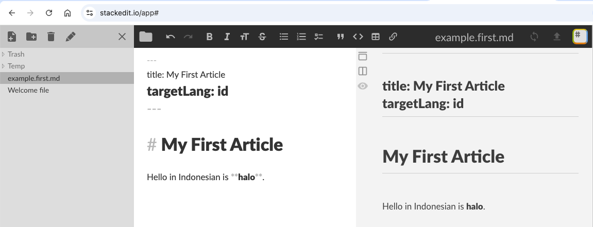
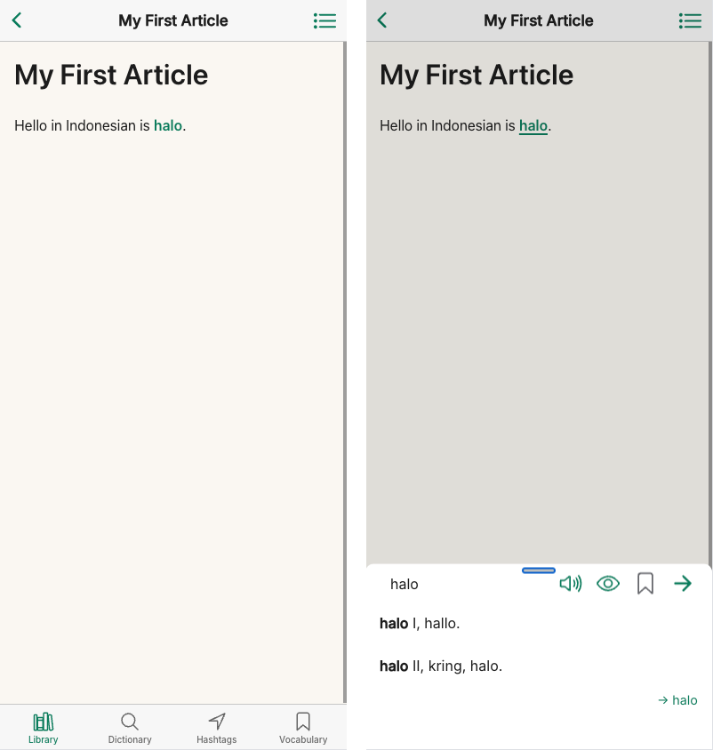

# Content Management Guide

_This guide is for content creators and administrators of Taalwiz, not for end users._
End-user help lives inside the app itself (the **Help** item in the sidebar) and is
maintained separately from this site.

This guide describes how to create, organise, and publish content in Taalwiz. Content is managed as plain text files that are uploaded through the admin interface.

---

## Getting started

If you have only ever written documents in a word processor like Microsoft Word, start here. Taalwiz content is not written in Word; it is written in plain text files using an annotation format known as **Markdown**. The workflow is a little different from what you are accustomed to with Word, but it is quick to learn.

### What is Markdown?

Markdown is **plain text** with special formatting annotation understood by a Markdown formatter to produce richly formatted text. Instead of clicking a **Bold** button you type `**word**`; instead of a bullet-list button you start a line with `- `. A live preview shows the formatted result as you type, so you are never working blind.

In Taalwiz some of that same formatting annotation plays a dual role: for formatting the text, and for indicating which words should be *tappable*. For instance, when a word marked up with asterisks is tapped, that word is looked up in the dictionary and Taalwiz will open a dialog box to show the lookup results. That is why you mark up words with the Markdown annotation rather than clicking buttons to make words bold, etc. as you would do in Word, and why getting them right matters. The [Writing Article Content](#writing-article-content) section covers every symbol you will need.

### Get an editor with live preview

You need an editor that understands Markdown and shows a live preview side by side. Two good choices:

- **Easiest, nothing to install:** [StackEdit](https://stackedit.io) runs in your web browser. Write in the left pane and the formatted result appears on the right; when you are done, use its _Download_ menu to save the file.
- **More powerful (what we use):** [Visual Studio Code](https://code.visualstudio.com) is a free desktop editor. Open a `.md` file and press `Ctrl`/`Cmd` + `Shift` + `V` to open the preview beside your text.

A few habits keep your text clean:

- **Open existing files; do not paste them in.** To work from an existing article (the recommended way to start, below), open it directly — in StackEdit via the ☰ menu → _Import/export → Import Markdown_, in VS Code by opening the `.md` file. Copying Markdown out of a rendered page and pasting it back in can drag in hidden formatting that shows up as stray blank lines or broken tables.
- **Paste as plain text.** If you do paste text in (from Word, an email, a web page), use plain-text paste (`Ctrl`/`Cmd` + `Shift` + `V`).
- **Do not author in Word.** A Word document ("Save As") is not plain text and will not work.

### Files are plain text named `.md`

Each article is one plain-text file whose name ends in `.md` (for example `indonesian.greetings.md`), never `.docx`. The [File Naming](#file-naming) section explains the naming rules.

### Write your first article

The easiest way to start is from an article that already exists. Open an existing `{group}.{name}.md` file in your editor (see the note above on opening rather than pasting), save it under a new name, and change the text. You get a working file with the front matter already correct, plus a real example to copy the conventions from.

Prefer to start from scratch? Here is a minimal article as plain text and what it looks like in StackEdit (Figure 1 and 2):

```markdown
---
title: My First Article
targetLang: id
---

# My First Article

Hello in Indonesian is **halo**.
```

**Figure 1**: Plain text markdown content



**Figure 2**: Markdown content entered in StackEdit

StackEdit shows only the Markdown formatting, so `**halo**` simply appears in bold. Only Taalwiz adds a further meaning to that bold (and italic) markup: the word becomes **tappable**, opening a dictionary lookup. That behaviour appears only in the app (Figure 3), not in an editor's preview.

When starting from scratch:

1. Enter the text while also watching the preview update. `**halo**`, wrapped in double asterisks, shows in bold and becomes tappable in the app. 
2. Save the file with a name like `example.first.md`.

The block between the `---` lines at the top is referred to as **front matter**: it is *metadata* defining a few required settings. Keep its layout exactly as shown, indentation included, or the upload will be rejected. The **Article Files** section below lists every field. (StackEdit's preview shows this front-matter block, as in Figure 2, whereas the Taalwiz app hides it, as in Figure 3.)

You cannot publish a single article on its own: to appear in the app it must belong to a publication, which means adding it to a manifest and uploading. The sections below cover both. Once published, it looks like this in the Taalwiz app:



**Figure 3**: Example article in Taalwiz with bold word **halo** tapped

---

## Overview

Content is organised in **publications**. Each publication is a named group of articles, for example a language course or a reference guide. Three types of file exist:

| File | Purpose |
|---|---|
| `main.manifest.md` | Lists all publications and their display order |
| `{group}.manifest.md` | Describes one publication and lists its articles in order |
| `{group}.{name}.md` | One article belonging to a publication |

All files are Markdown with a YAML front matter block enclosed by `---` lines.

---

## Writing Article Content

The body of an article (everything below the front-matter block) is where you do most of your work. It supports standard Markdown, plus two Taalwiz-specific features: clickable dictionary words and inline quiz blanks. If you are used to a word processor, each symbol below replaces a button you would normally click. The basics:

- `# Heading 1` / `## Heading 2` / `### Heading 3`
- Emphasis, see the asterisk vs. underscore rule below
- `` `inline code` `` and fenced code blocks
- Ordered and unordered lists
- Blockquotes (`>`)
- Horizontal rules (`---`)
- Links: `[text](url)`
- Strikethrough doubles as a **fill-in-the-blank quiz blank**, see below

HTML is not permitted in article bodies.

### Emphasis: asterisks vs. underscores (important)

Taalwiz overloads Markdown emphasis to mark **clickable dictionary lookup words**. Every word wrapped in **asterisks** becomes tappable: tapping it opens a dictionary lookup for that word. **Underscores** produce the same visual styling but are **not** clickable.

| Markdown | Renders as | Clickable lookup? | Use for |
|---|---|---|---|
| `*word*` | _word_ (italic) | **Yes** | Indonesian/target-language words a learner can look up |
| `**word**` | **word** (bold) | **Yes** | Emphasised target-language words a learner can look up |
| `_word_` | _word_ (italic) | No | Ordinary emphasis: Dutch words, UI labels, asides |
| `__word__` | **word** (bold) | No | Ordinary bold emphasis that should not be tappable |

Rule of thumb: **asterisks for target-language words you want learners to tap and look up; underscores for everything else.**

Getting this wrong is silent and easy to miss: an asterisk on a Dutch or English word produces a clickable word whose dictionary lookup is meaningless, and an underscore on an Indonesian word denies the learner a lookup they would expect. When in doubt, for any non-target-language emphasis, use underscores.

Mark the word **as it appears in your sentence**, affixes and all. The lookup is morphology-aware: an inflected form such as `*membaca*` or `*dibakar*` resolves to the right dictionary entry on its own, so you do not need to reduce it to its base first. The [How Search Works](./how-search-works) guide explains how that resolution happens.

### Fill-in-the-blank quiz blanks

Markdown **strikethrough** (`~~ ~~`) doubles as an interactive quiz blank inside an article. The hidden answer renders as a placeholder; the learner taps it to reveal or to answer. There are two modes, chosen automatically by whether the strikethrough text contains a `|`:

**Recall blank (no `|`)** — a single hidden answer the learner tries to recall, then taps to reveal (tapping again hides it):

```markdown
Hij is geen student: Dia ~~bukan~~ mahasiswa.
```

**Multiple choice (`|`-separated options)** — the learner taps one of several options. Mark the correct option with a leading `=` and separate options with `|`. The app strips the `=`, **shuffles** the options, and renders them as tappable chips. The first tap is final: the chosen chip turns green if correct or red if wrong (with the correct option highlighted), then the blank locks.

```markdown
De actieve vorm is ~~=membuka|buka|terbuka|dibuka|membukakan~~.
```

**Rules and notes:**

| Markdown | Behaviour |
|---|---|
| `~~answer~~` | Recall blank: tap to reveal/hide the answer |
| `~~=correct\|wrong\|wrong~~` | Multiple choice: tap an option; `=` marks the correct one |

- The `=` marker is **only** for multiple choice; a recall blank never needs it.
- Quiz blanks do **not** interfere with tap-to-search: the hidden text is never a clickable dictionary word. Conversely, keep the answer and options as **plain words**, do not put emphasis inside a blank (write `~~=membuka|buka~~`, not `~~=*membuka*|buka~~`), otherwise the emphasised word is treated as a separate lookup word.
- Answers and options may be more than one word (e.g. `~~tidak ada~~`, `~~=tidak ada|belum ada~~`).
- The answer's length is not leaked: the placeholder is a fixed width regardless of how long the answer is.

---

## Hashtags

Hashtags mark topics or index terms within article text. They appear as clickable links in the app, and tapping one opens an index of all articles that carry the same hashtag.

### Syntax

Single-word tag, write `#` directly before the word:

```
The word #selamat means "greetings".
```

Multi-word tag, wrap in curly braces:

```
The phrase #{selamat pagi} means "good morning".
```

Tags are **case-insensitive**: they are stored and indexed in lowercase (so the Hashtags tab always shows them lowercase), but the rendered tag keeps the casing you wrote, so `#Verkeersborden` displays as written while still matching `#verkeersborden`. Tags must be at least two characters long.

Tags work anywhere in the text, **including inside headings**. A heading's own leading `#`/`##` marker is never treated as a tag; only `#tag` words within the heading text are indexed (use the `#{...}` braces form for a multi-word tag in a heading).

### Requirements

Hashtag extraction requires the group manifest to exist in the database. If articles are uploaded before their group manifest, hashtags are not extracted at that point. When the group manifest is subsequently uploaded, the system automatically reprocesses all existing articles in the group and extracts their hashtags. No manual re-upload of articles is needed.

### Reviewing hashtag usage (admin only)

To keep tags consistent, it helps to see which hashtags already exist before inventing a new one. **Admin → Hashtag Usage** (under the **Hashtags** section of the admin sidebar) shows a glossary of every hashtag currently in use across all content. _This page requires admin rights._

The page lists each tag alphabetically with two counts:

| Column | Meaning |
|---|---|
| Articles | Number of distinct articles that contain the tag |
| Uses | Total number of occurrences across all articles |

A search box filters the list as you type. You can **copy** the full glossary to the clipboard, **download** it as `taalwiz-hashtags.txt`, or **print** it. The export and print actions always use the complete list, not the filtered view, so you get the whole glossary regardless of any active filter.

Use this glossary to spot near-duplicates (for example `#verb` versus `#verbs`) and reuse an existing tag rather than creating a variant.

---

> **Ready to publish?** Writing the body is only half of it. To publish an article you must give the file the right name, add a small front-matter block (notably the required `targetLang`), and list it in a manifest. Those mechanics are covered below.

---

## File Naming

The **group name** is the short identifier for a publication (e.g. `indonesian`, `grammar-ref`). It must be lowercase, use only letters, digits, and hyphens, and must not be `main` (that is reserved).

| File type | Example |
|---|---|
| Main manifest | `main.manifest.md` |
| Group manifest | `indonesian.manifest.md` |
| Article | `indonesian.intro.md` |
| Article | `indonesian.verb-forms.md` |

The part after the group name and before `.md` is the article's **short name** (e.g. `intro`, `verb-forms`). It must be unique within the group and must not be `manifest`.

---

## Article Files (`{group}.{name}.md`)

Each article is a Markdown file with front matter. The body is standard Markdown (see [Writing Article Content](#writing-article-content) above for the markup, emphasis, and quiz-blank rules). Use the block below as a template, replacing the values with your own:

```markdown
---
title: Greetings
subtitle: Common greetings and polite expressions
targetLang: id
---

# Greetings

## Formal greetings

Use *Selamat pagi* in the morning...
```

**Front matter fields:**

| Field | Required | Description |
|---|---|---|
| `title` | No | Article title. If omitted, the first `# H1` heading is used. |
| `subtitle` | No | Short description. If omitted, all `## H2` headings are concatenated. |
| `targetLang` | Yes | Must equal the deployment's target language (currently `id`). The upload is rejected if it is missing or different. |
| `author` | No | Author (if different from publication author) |

**Title and subtitle fallback rules:**

- If `title` is absent, the first `# Heading` in the body is used. If there is no H1 either, the title becomes `untitled`.
- If `subtitle` is absent, all `## Headings` are joined with ` • ` as the subtitle.

---

## Group Manifests (`{group}.manifest.md`)

Each publication has one group manifest. It carries the publication's metadata and the ordered list of its articles. The body text (below the closing `---`) becomes the **preface article**, the first article shown in the article list. Use the block below as a template:

```markdown
---
title: Indonesian for Dutch Speakers
author: J. de Vries
targetLang: id
articles:
  - intro
  - greetings
  - numbers
  - verb-forms
---

# Welcome

This course introduces Indonesian to speakers of Dutch.
Work through the articles in order for the best results.
```

**Front matter fields:**

| Field | Required | Description |
|---|---|---|
| `title` | Yes (or H1 in body) | Publication title shown in the app |
| `articles` | Yes | Ordered list of article short names. Display order follows this list. |
| `targetLang` | Yes | Must equal the deployment's target language (currently `id`). The upload is rejected if it is missing or different. |
| `author` | No | Author name |
| `subtitle` | No | Short description shown under the title |
| `image` | No | Publication cover image filename (e.g. `bumi-manusia.jpg`); upload the image alongside the manifest |
| `publisher` | No | Publisher name |
| `publicationYear` | No | Year of publication (integer) |
| `copyright` | No | Copyright notice |
| `isbn` | No | ISBN |

**To add an article:** add its short name to the `articles` list in the desired position, then upload the updated manifest and the new article file.

**To remove an article from the list:** remove its short name from `articles` and re-upload the manifest. The article file remains in the database as an orphan but is no longer shown. Use the admin orphan tool to delete it.

**To reorder articles:** change the order in the `articles` list and re-upload the manifest.

---

## The Main Manifest (`main.manifest.md`)

The main manifest controls which publications exist and in what order they appear in the app.

```markdown
---
groups:
  - indonesian
  - grammar-ref
  - dutch-basics
---
```

**Front matter fields:**

| Field | Required | Description |
|---|---|---|
| `groups` | Yes | Ordered list of group names. Display order follows this list. |

The file has no body text. The main manifest does **not** take a `targetLang` field; it is a language-agnostic index of publications.

**To add a publication:** add its group name to the `groups` list, then upload the updated `main.manifest.md` together with the corresponding `{group}.manifest.md`.

**To remove a publication:** remove its group name from the list and upload the updated file. The publication's articles become orphans (they remain in the database but are no longer shown). Use the admin orphan tool to delete them.

**To reorder publications:** change the order in the `groups` list and re-upload the file.

---

## Upload Workflow

Files are uploaded one at a time (or in a batch) via **Admin → Upload**. The system accepts `.md` and `.json` content files plus publication images (`.jpg`, `.jpeg`, `.png`, `.gif`, `.webp`). Upload order does not matter; the system handles any order correctly.

### Target language check

Every uploaded **article** and **group manifest** must declare a `targetLang` in its front matter equal to the deployment's target language (currently `id`). If `targetLang` is missing or different, the upload is rejected with a `400` error naming the file. This guards against accidentally uploading content prepared for a different language deployment.

The **main manifest is exempt** (it is a language-agnostic index), and **dictionaries are not checked**: a dictionary's `targetLang` is its _headword_ language, which may legitimately differ from the deployment language (e.g. a reverse-direction dictionary), so dictionaries remain language-agnostic.

### First-time setup (new publication)

Upload all files in any order:

- `main.manifest.md`
- `{group}.manifest.md` for each publication
- All article files (`{group}.{name}.md`)

When a group manifest is processed, the system automatically reprocesses hashtag extraction for any articles of that group that are already in the database. Everything will be consistent once all files have been uploaded.

### Adding a new article to an existing publication

1. Write the article file `{group}.{name}.md`
2. Add the short name to the `articles` list in `{group}.manifest.md`
3. Upload both files in any order

### Reordering or updating articles

Edit the relevant manifest's `articles` list or update the article file and re-upload. The system uses an MD5 checksum; files whose content has not changed are silently skipped.

### Removing a publication

1. Remove the group name from `main.manifest.md` and upload it
2. Use the admin orphan tool to delete the group manifest and its articles from the database

---

## Orphaned Files

An **orphan** is a file that exists in the database but is not referenced by any manifest:

- An article whose short name has been removed from its group manifest
- A group manifest whose group name has been removed from `main.manifest.md`

Orphans are not shown to users. Use the admin orphan management tool to review and delete them.
