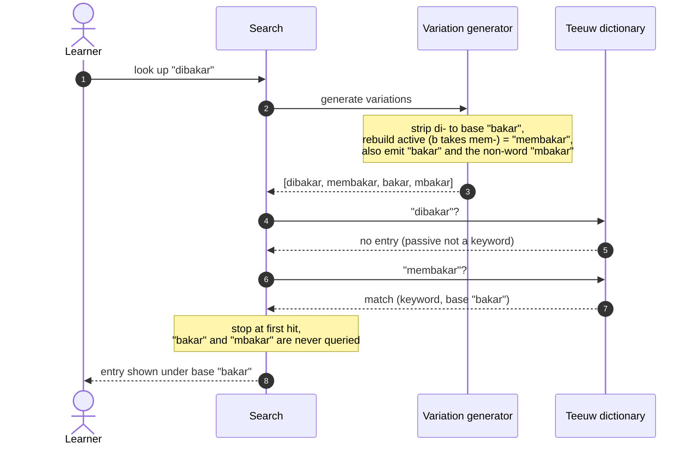
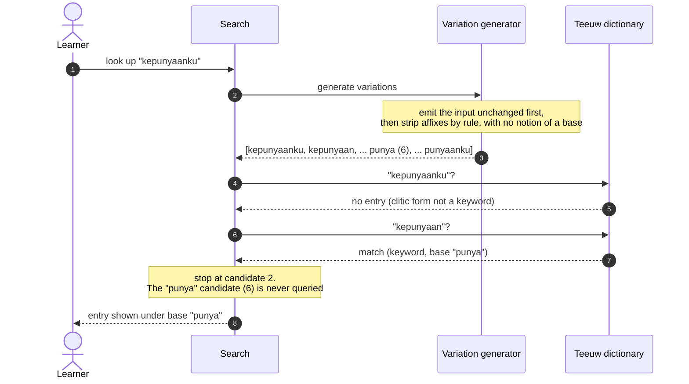

# How Search Works

This page explains how Taalwiz resolves an Indonesian word a learner types into the
dictionary search box, with a focus on the morphology.

::: info Audience
This page is written for **linguists**. It assumes a reading knowledge of Indonesian
(Malay) affixational morphology and uses standard terminology without glossing it. It is
**not** end-user help: a regular user needs none of this to use the dictionary, they just
type a word and read the result. Implementation notes for developers live with the code
(see [For developers](#for-developers) at the end).
:::

## The problem

Indonesian is richly affixing. A single base such as _bakar_ ("burn") surfaces in
running text as _membakar_, _dibakar_, _membakarkan_, _terbakar_, _pembakaran_, and
more. A learner reading a sentence meets the affixed form, not the base, and types
exactly what they see. The dictionary behind the search is Teeuw's
_Indonesisch-Nederlands Woordenboek_, digitised from the 1996 print edition. Its
**headwords** are mostly bases, with common derivations listed beneath each headword as
**sublemmas** rather than as headwords of their own. There is no entry for every possible
affixed form.

So the search has a gap to bridge: from the affixed form the user typed to some form the
dictionary actually lists, whether a headword or a sublemma.

## From print entries to a searchable index

Two vocabularies meet on this page; keeping them apart makes everything below precise.

In the **print dictionary**, Teeuw is organised by **headword**, mostly a base (root).
Derived forms get no headword of their own: they sit beneath the headword as
**sublemmas**, bold sub-entries with their own glosses. A word cited in passing that is
defined under its own headword elsewhere is a **word reference**.

In the **digitised index** the app actually searches, each of those bold forms, the
headword _and_ every sublemma, becomes a **keyword**: an independently searchable string.
A successful match surfaces grouped under its **base**, the headword/root that anchors the
group, which is also the morphological base the derivations are built on.

| Print Teeuw (lexicography)         | Taalwiz index (engineering)                          |
| ---------------------------------- | ---------------------------------------------------- |
| headword (a base)                  | a **keyword**, and the **base** that anchors the group |
| sublemma (nested derivation)       | a **keyword** under that base                        |
| word reference (defined elsewhere) | resolves to a keyword (which may itself be a base)    |

So when this page says a candidate "matches a keyword," that keyword may be a headword or
a sublemma; either way the entry surfaces under its base. The _kepunyaanku_ example below
walks the whole chain, print to index to lookup, on one real word.

## The core idea: generate candidates, let the dictionary judge

Taalwiz does **not** try to analyse a word down to its one "true" base. Instead it
generates a _set_ of plausible candidate forms by stripping and rebuilding affixes,
then looks each candidate up in turn and stops at the first one the dictionary
lists as a keyword (a headword or a sublemma). In information-retrieval terms this is a generate-and-test
(over-generate-and-filter) strategy rather than morphological analysis: the generator
favours recall, and the dictionary supplies precision.

This is deliberately not a stemmer. A stemmer commits to a single answer; if it is
wrong, the lookup fails. Taalwiz instead casts a wider net and lets the **dictionary
be the judge of what is real**. Some generated candidates are not Indonesian words at
all. That is fine: a non-word simply finds nothing and the search moves on to the next
candidate. A false candidate costs one extra lookup; a missing candidate costs the
user their answer. The design optimises against the second, more expensive failure.

The generator emits its candidates in a fixed order set by its recursion, not by any
ranking it computes, and with no notion of which form is a base. The one part that matters
for lookup: the original form is tried first, in case it is already a keyword. After that
the algorithm strips and re-adds affixes until it is exhausted, emitting well-formed
derivations (such as a rebuilt active _meN-_ form, which the dictionary often lists)
intermixed with non-words. Empirically, the forms most likely to be keywords tend to
surface before the long shots.

Because the lookup stops at the first hit, this ordering means that on a successful
search the later, less plausible candidates (including any non-words) are often never
queried at all.

## A note on Indonesian morphology

The generator knows the regular affix system. The parts most relevant to lookup:

| Type | Examples | Function |
| --- | --- | --- |
| Suffixes | `-kan`, `-i`, `-an` | `-kan`: causative/instrumental/benefactive; `-i`: locative/repetitive; `-an`: forms nouns |
| Bound pronouns (suffixed) | `-ku`, `-mu`, `-nya` | object of an active verb, possessor, or passive agent |
| Particles | `-lah`, `-kah`, `-pun`, `-tah` | mood, focus, concessive |
| Simple prefixes | `di-`, `ber-`, `ter-`, `ke-`, `se-`, `per-` | `di-` passive, `ber-` intransitive verb, `ter-` accidental/abilitative, `ke-` ordinal/collective, `se-` "one/same", `per-` causative |
| Nasal prefixes | `meN-`, `peN-` | `meN-` active verb; `peN-`/`pe-` noun for the person or instrument of the action |
| Circumfixes | `ke-...-an`, `per-...-an`, `peN-...-an` | `ke-...-an` abstract noun, `per-...-an` process/place noun, `peN-...-an` action noun |
| Reduplication | `anak-anak` &rarr; `anak` | plurality, iteration, derivation |

The linguistically interesting part is the **nasal prefix _meN-_** (and its noun
counterpart _peN-_). The capital _N_ stands for the nasal element, which surfaces as
_me-_, _mem-_, _men-_, _meng-_ or _meny-_ depending on the bases first sound. For one
class of bases, those beginning with a voiceless consonant (_p, t, s, k_), that initial
consonant is **lost** when the prefix attaches:

| Base initial | Realisation of _meN-_ | Example | Base |
| --- | --- | --- | --- |
| vowel | _meng-_ | _mengambil_ | _ambil_ |
| _b_, _f_ | _mem-_ | _membaca_ | _baca_ |
| _d_, _c_, _j_ | _men-_ | _mendapat_ | _dapat_ |
| _g_, _h_ | _meng-_ | _menggaris_ | _garis_ |
| _l_, _r_, _m_, _n_, _w_, _y_ | _me-_ | _melakukan_ | _lakukan_ |
| **_p_** (lost) | _mem-_ | _memotong_ | _potong_ |
| **_t_** (lost) | _men-_ | _menulis_ | _tulis_ |
| **_s_** (lost) | _meny-_ | _menyapu_ | _sapu_ |
| **_k_** (lost) | _meng-_ | _mengarang_ | _karang_ |

The dropped-consonant rows are why analysis is ambiguous in the _reverse_ direction.
Seeing _menulis_, you cannot tell from the surface alone whether the base began with
_t_ (it did: _tulis_) or was vowel-initial (_ulis_, which would also yield a form
starting _men-..._). The generator does not try to decide. It emits **both** the
bare-stripped form and the consonant-restored form, and lets the dictionary confirm
which one exists.

## Worked examples

The three examples below trace real lookups, from simple to complex. The first two carry
a sequence diagram showing the variation generator producing candidates and the dictionary
(the offline Teeuw index) accepting or rejecting each one in order.

You can reproduce any of these yourself with the developer trace tool described
[below](#for-developers).

### 1. A passive form: _dibakar_

The user reads _dibakar_ ("was burned") and types it. The passive _di-_ form is not a
Teeuw keyword, but the generator rebuilds the active _membakar_, which is.



The point: the generator produced four candidates, one of them ("mbakar") not a word.
It did no harm. The active form was found on the second lookup and the rest were never
needed.

### 2. Stopping at a sublemma, not the base: _kepunyaanku_

The user types _kepunyaanku_ ("my possession"), which is _ke-_ + _punya_ ("to own") +
_-an_ + the possessive clitic _-ku_. This one is worth following end to end, because it
shows how Teeuw's printed layout becomes the index the search queries.

In print, _punya_ is a headword set at the left margin; its derivations are nested
beneath it, indented:


The digitised source preserves that layout. The headword comes first; the bold run-on
forms are its sublemmas; the italic forms are examples and word references:

```text
**punya**, 1 hebben, bezitten;
*saya ~ uang itu*, ik heb dat geld;
... (further senses and examples) ...
**punyaku**(, **punyamu**), van mij(, jou) ...;
**berpunya**, 1 eigenaar hebben ...;
**mempunyai, mengempunyai** O, bezitten ...;
**kepunyaan**, bezit, eigendom, toebehoren.
```

The compiler reads that whole block (the text between two blank lines) into a single
**base** with many **keywords**:

| In the source                                                    | Parsed as                       | A search target?                       |
| ---------------------------------------------------------------- | ------------------------------- | -------------------------------------- |
| `**punya**`, the headword                                        | **base** `punya`                | yes, as the base itself                |
| `**punyaku**`, `**berpunya**`, `**mempunyai**`, `**kepunyaan**` … | **keywords** under base `punya` | yes, each one                          |
| `*saya ~ uang itu*`, `*yg ~*` …                                  | examples and word references    | no (references resolve to their own keyword) |

So `kepunyaan` is not a headword: it is a **sublemma**, stored as a keyword whose base is
`punya`. That is the form the search lands on. (The encoding rules are spelled out in the
compiler's `TEEUW_PARSER.md`.)

The generator knows none of this. It mechanically strips and re-adds affixes, running its
rules to exhaustion. For _kepunyaanku_ it produces, in order: _kepunyaanku_, _kepunyaan_,
_kepunya_, _kepu_, _pu_, _punya_, _punyaan_, _punyaanku_. This is not a march toward a
base: some candidates come from stripping affixes, others from _adding_ one that was never
there (_punyaan_, _punyaanku_), and the bare root _punya_ lands at position 6, ahead of two
of the nonsense forms rather than at the end. The generator does not stop when it happens
to produce a real word. What stops early is the _lookup_: _kepunyaan_, candidate 2, is a
keyword, so the search halts there, long before the rest are reached.



The point: the search stops at _kepunyaan_, a **sublemma**, and the entry surfaces under
its **base** _punya_, without the lookup ever querying the bare _punya_ candidate that the
generator did produce. Matching the sublemma keyword already routes to the base. Of the
eight candidates only two are queried (_kepunyaanku_, then _kepunyaan_); the rest, the
real base and the nonsense alike, are never looked up.

### 3. A word the dictionary does not contain: _diinstal_

Finally, the user types _diinstal_ ("was installed"), from the loanword _instal_. The
generator does everything right: it strips _di-_ to _instal_, rebuilds the active
_menginstal_, and emits the non-word _nginstal_. But Teeuw was published in 1996 and
predates this borrowing, so none of the four candidates (_diinstal_, _menginstal_,
_instal_, _nginstal_) is a keyword. Each is queried in turn and rejected, and the search
returns no result. This is also what happens on a **typo**: the forms are well-shaped, but
there is nothing for them to match.

The dictionary is the final authority, and its verdict here is simply that the word is not
in Teeuw. A generator that had "analysed" its way to a confident single base would report
the same emptiness, only after more work.

## Why not a stemmer?

A stemmer (for Indonesian, the classic Nazief and Adriani algorithm, or the Enhanced
Confix Stripping method behind the Sastrawi library) reduces a word to a single
canonical base. It is the natural tool for some jobs, but **dictionary lookup is not
one of them**, for two reasons:

1. Teeuw already returns the canonical base on every successful hit, so reducing the
   query to a base first adds little.
2. The generator produces not only the base but **sideways forms** a stemmer never
   would: from passive _dibakar_ it offers active _membakar_, a keyword the dictionary
   lists in its own right and often the form a learner most needs. A stemmer aiming at a
   single base would skip straight past it.

There _is_ a natural home for a real stemmer in Taalwiz, but it is a different feature:
**free-text search over article content**. To search a body of text, you normalise both
the query and every word in the text to a shared base key, so that a search for
_memukul_ matches an article containing _dipukul_. That is the textbook stemming use
case (many-to-many matching at scale), and it is genuinely distinct from resolving one
typed word against one dictionary. Until that feature exists, the candidate generator
is the right tool.

## Further reading

- James Neil Sneddon, K. Alexander Adelaar, Dwi Noverini Djenar and Michael C. Ewing,
  _Indonesian: A Comprehensive Grammar_ (2nd ed., Routledge, 2010). The reference grammar
  for the affix descriptions and terminology on this page.
- B. Nazief and M. Adriani, _Confix-Stripping: Approach to Stemming Algorithm for Bahasa
  Indonesia_ (Faculty of Computer Science, University of Indonesia, 1996), and the
  Enhanced Confix Stripping (ECS) method implemented by the Sastrawi stemmer, both
  discussed under [Why not a stemmer?](#why-not-a-stemmer).

## For developers

The candidate generation lives in `indonesian-variation-generator.ts`; the lookup loop
that queries each candidate and stops at the first keyword hit is
`DictionaryService.#searchLocal()`. The full implementation notes (focus handling,
IndexedDB indexes, result grouping, breadcrumbs) are in `SEARCH.md` alongside the code.

To reproduce the traces on this page against the live compiled dictionary:

```bash
pnpm --filter compiler run trace dibakar kepunyaanku diinstal
```

This reuses the production variation generator and the compiled Teeuw index, so its
hit/miss output is exactly what the app does at runtime.
