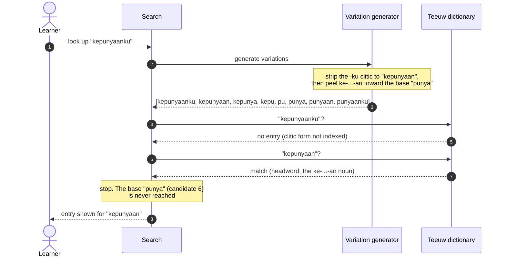
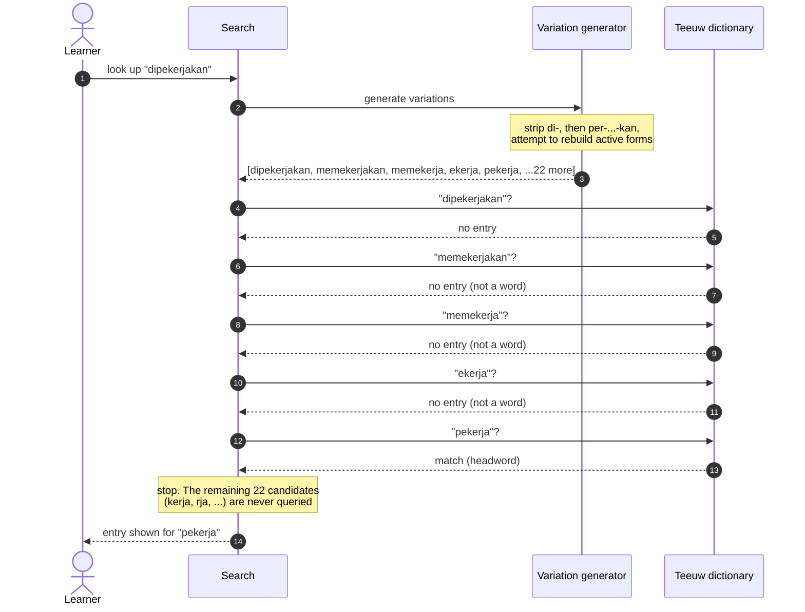
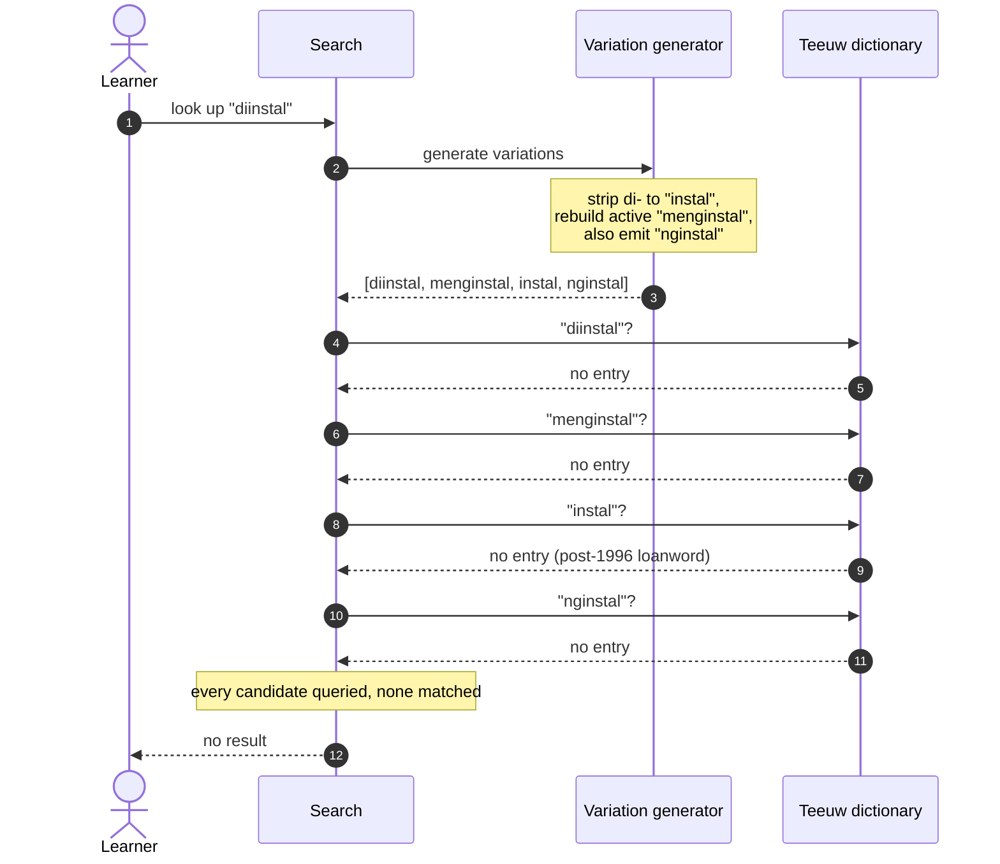

# How Search Works

This page explains how Taalwiz resolves an Indonesian word a learner types into the
dictionary search box, with a focus on the morphology.

::: info Audience
This page is written for **linguists**. It assumes a reading knowledge of Indonesian
(Malay) affixational morphology and uses standard terminology without glossing it. It is
**not** end-user help: a regular user needs none of this to use the dictionary, they just
type a word and read the result. Implementation notes for developers live with the code
(see [For developers](#for-developers) at the end).
:::

## The problem

Indonesian is richly affixing. A single base such as _bakar_ ("burn") surfaces in
running text as _membakar_, _dibakar_, _membakarkan_, _terbakar_, _pembakaran_, and
more. A learner reading a sentence meets the affixed form, not the base, and types
exactly what they see. The dictionary, however, is the printed Teeuw
_Indonesisch-Nederlands Woordenboek_, whose headwords are mostly bases and a selection
of common derivations. There is no entry for every possible affixed form.

So the search has a gap to bridge: from the affixed form the user typed to a
headword the dictionary actually contains.

## The core idea: generate candidates, let the dictionary judge

Taalwiz does **not** try to analyse a word down to its one "true" base. Instead it
generates a _set_ of plausible candidate forms by stripping and rebuilding affixes,
then looks each candidate up in turn and stops at the first one the dictionary
recognises as a headword. In information-retrieval terms this is a generate-and-test
(over-generate-and-filter) strategy rather than morphological analysis: the generator
favours recall, and the dictionary supplies precision.

This is deliberately not a stemmer. A stemmer commits to a single answer; if it is
wrong, the lookup fails. Taalwiz instead casts a wider net and lets the **dictionary
be the judge of what is real**. Some generated candidates are not Indonesian words at
all. That is fine: a non-word simply finds nothing and the search moves on to the next
candidate. A false candidate costs one extra lookup; a missing candidate costs the
user their answer. The design optimises against the second, more expensive failure.

The candidate list is ordered so the most likely headwords come first:

1. **The original form**, in case it is indexed directly.
2. **Common derivations**, especially the active _meN-_ form, which the dictionary
   usually does list.
3. **Bare bases and rarer variants** last, as a fallback.

Because the lookup stops at the first hit, this ordering means that on a successful
search the later, less plausible candidates (including any non-words) are often never
queried at all.

## A note on Indonesian morphology

The generator knows the regular affix system. The parts most relevant to lookup:

| Type | Examples | Function |
| --- | --- | --- |
| Suffixes | `-kan`, `-i`, `-an` | `-kan`: causative/instrumental/benefactive; `-i`: locative/repetitive; `-an`: forms nouns |
| Bound pronouns (suffixed) | `-ku`, `-mu`, `-nya` | object of an active verb, possessor, or passive agent |
| Particles | `-lah`, `-kah`, `-pun`, `-tah` | mood, focus, concessive |
| Simple prefixes | `di-`, `ber-`, `ter-`, `ke-`, `se-`, `per-` | `di-` passive, `ber-` intransitive verb, `ter-` accidental/abilitative, `ke-` ordinal/collective, `se-` "one/same", `per-` causative |
| Nasal prefixes | `meN-`, `peN-` | `meN-` active verb; `peN-`/`pe-` noun for the person or instrument of the action |
| Circumfixes | `ke-...-an`, `per-...-an`, `peN-...-an` | `ke-...-an` abstract noun, `per-...-an` process/place noun, `peN-...-an` action noun |
| Reduplication | `anak-anak` &rarr; `anak` | plurality, iteration, derivation |

The linguistically interesting part is the **nasal prefix _meN-_** (and its noun
counterpart _peN-_). The capital _N_ stands for the nasal element, which surfaces as
_me-_, _mem-_, _men-_, _meng-_ or _meny-_ depending on the base's first sound. For one
class of bases, those beginning with a voiceless consonant (_p, t, s, k_), that initial
consonant is **lost** when the prefix attaches:

| Base initial | Realisation of _meN-_ | Example | Base |
| --- | --- | --- | --- |
| vowel | _meng-_ | _mengambil_ | _ambil_ |
| _b_, _f_ | _mem-_ | _membaca_ | _baca_ |
| _d_, _c_, _j_ | _men-_ | _mendapat_ | _dapat_ |
| _g_, _h_ | _meng-_ | _menggaris_ | _garis_ |
| _l_, _r_, _m_, _n_, _w_, _y_ | _me-_ | _melakukan_ | _lakukan_ |
| **_p_** (lost) | _mem-_ | _memotong_ | _potong_ |
| **_t_** (lost) | _men-_ | _menulis_ | _tulis_ |
| **_s_** (lost) | _meny-_ | _menyapu_ | _sapu_ |
| **_k_** (lost) | _meng-_ | _mengarang_ | _karang_ |

The dropped-consonant rows are why analysis is ambiguous in the _reverse_ direction.
Seeing _menulis_, you cannot tell from the surface alone whether the base began with
_t_ (it did: _tulis_) or was vowel-initial (_ulis_, which would also yield a form
starting _men-..._). The generator does not try to decide. It emits **both** the
bare-stripped form and the consonant-restored form, and lets the dictionary confirm
which one exists.

## Worked examples

The four examples below trace real lookups, from simple to complex. Each diagram
shows the variation generator producing candidates and the dictionary (the offline
Teeuw index) accepting or rejecting each one in order.

You can reproduce any of these yourself with the developer trace tool described
[below](#for-developers).

### 1. A passive form: _dibakar_

The user reads _dibakar_ ("was burned") and types it. The passive _di-_ form is not a
Teeuw headword, but the generator rebuilds the active _membakar_, which is.


The point: the generator produced four candidates, one of them ("mbakar") not a word.
It did no harm. The active form was found on the second lookup and the rest were never
needed.

### 2. Stopping at a derivation, not the base: _kepunyaanku_

The user types _kepunyaanku_ ("my possession"), which is _ke-_ + _punya_ ("to own") +
_-an_ + the possessive clitic _-ku_. The generator strips the clitic and would peel the
circumfix all the way to the base, but the _ke-...-an_ noun _kepunyaan_ is itself a Teeuw
headword, so the lookup stops there.



The point: the search stops at the first form Teeuw indexes, which here is the
derivation _kepunyaan_, not the bare base _punya_. The generator would reach _punya_
eventually (it is candidate six), but it never needs to. This is what the ordering buys:
the most likely headwords are tried first, so the first hit is usually the most useful
one.

### 3. A multi-affix form with rejected non-words: _dipekerjakan_

Now the user types _dipekerjakan_ ("was employed"), a passive built on the circumfix
_per-...-kan_ around the base _kerja_ ("work"). The generator's attempts to rebuild an
active form here produce several shapes that are not Indonesian words. Each is dutifully
looked up and rejected before a real headword, the _pe-_ noun _pekerja_ ("worker", the
person who does the _ber-_ verb _bekerja_), is reached.



The point: three non-words (_memekerjakan_, _memekerja_, _ekerja_) were generated and
queried, and the dictionary rejected every one. The generator is not embarrassed by
this. Its job is recall, not precision; the dictionary supplies the precision.

### 4. A word the dictionary does not contain: _diinstal_

Finally, the user types _diinstal_ ("was installed"), from the loanword _instal_. Teeuw
was published in 1996 and predates this borrowing, so none of the candidates exist as
headwords. This is also what happens when a user makes a **typo**: the generated forms
are well-shaped, but there is simply nothing for them to match.



The point: the generator did everything right. It produced the correct base _instal_
and a well-formed active _menginstal_. The dictionary is still the final authority, and
its verdict here is that the word is not in Teeuw. A generator that had "analysed" its
way to a confident single base would report the same emptiness, only after more work.

## Why not a stemmer?

A stemmer (for Indonesian, the classic Nazief and Adriani algorithm, or the Enhanced
Confix Stripping method behind the Sastrawi library) reduces a word to a single
canonical base. It is the natural tool for some jobs, but **dictionary lookup is not
one of them**, for two reasons:

1. Teeuw already returns the canonical base on every successful hit, so reducing the
   query to a base first adds little.
2. The generator produces not only the base but **sideways forms** a stemmer never
   would: from passive _dibakar_ it offers active _membakar_, which is far more likely
   to be a headword than the bare base. A stemmer aiming at a single base would skip
   straight past the form the dictionary actually indexes.

There _is_ a natural home for a real stemmer in Taalwiz, but it is a different feature:
**free-text search over article content**. To search a body of text, you normalise both
the query and every word in the text to a shared base key, so that a search for
_memukul_ matches an article containing _dipukul_. That is the textbook stemming use
case (many-to-many matching at scale), and it is genuinely distinct from resolving one
typed word against one dictionary. Until that feature exists, the candidate generator
is the right tool.

## Further reading

- James Neil Sneddon, K. Alexander Adelaar, Dwi Noverini Djenar and Michael C. Ewing,
  _Indonesian: A Comprehensive Grammar_ (2nd ed., Routledge, 2010). The reference grammar
  for the affix descriptions and terminology on this page.
- B. Nazief and M. Adriani, _Confix-Stripping: Approach to Stemming Algorithm for Bahasa
  Indonesia_ (Faculty of Computer Science, University of Indonesia, 1996), and the
  Enhanced Confix Stripping (ECS) method implemented by the Sastrawi stemmer, both
  discussed under [Why not a stemmer?](#why-not-a-stemmer).

## For developers

The candidate generation lives in `indonesian-variation-generator.ts`; the lookup loop
that queries each candidate and stops at the first keyword hit is
`DictionaryService.#searchLocal()`. The full implementation notes (focus handling,
IndexedDB indexes, result grouping, breadcrumbs) are in `SEARCH.md` alongside the code.

To reproduce the traces on this page against the live compiled dictionary:

```bash
pnpm --filter compiler run trace dibakar kepunyaanku dipekerjakan diinstal
```

This reuses the production variation generator and the compiled Teeuw index, so its
hit/miss output is exactly what the app does at runtime.
