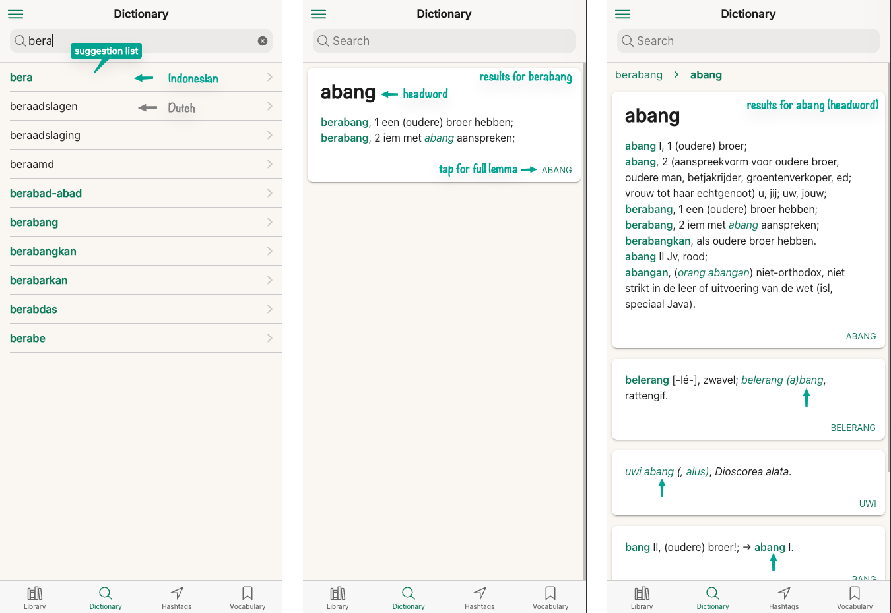
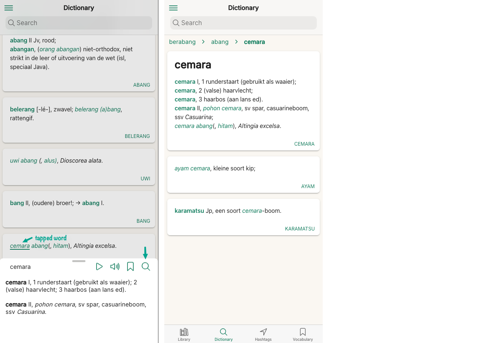
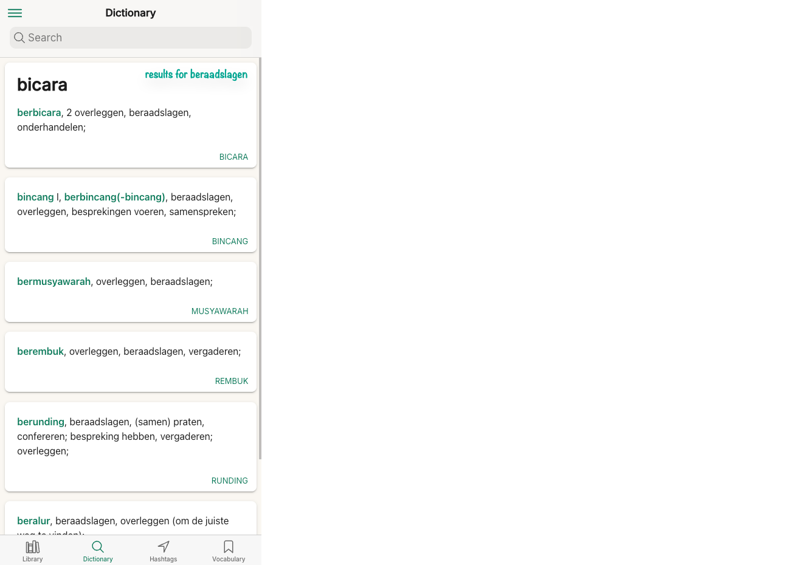
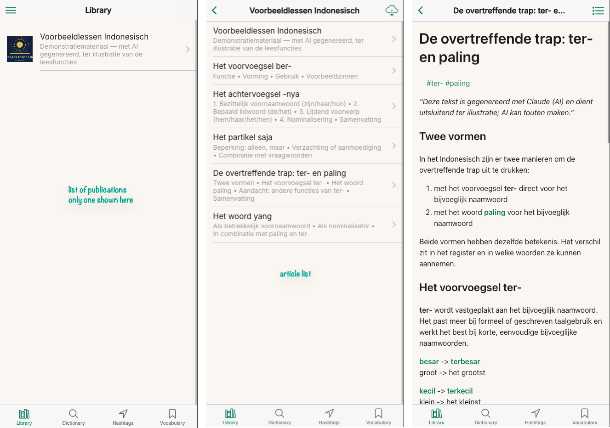
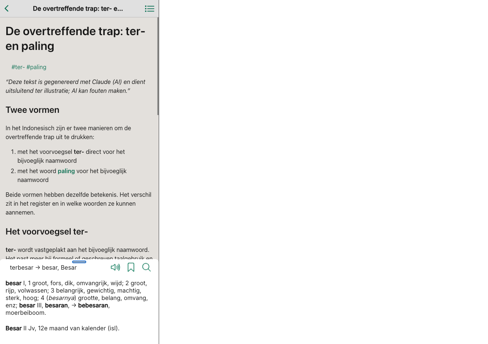
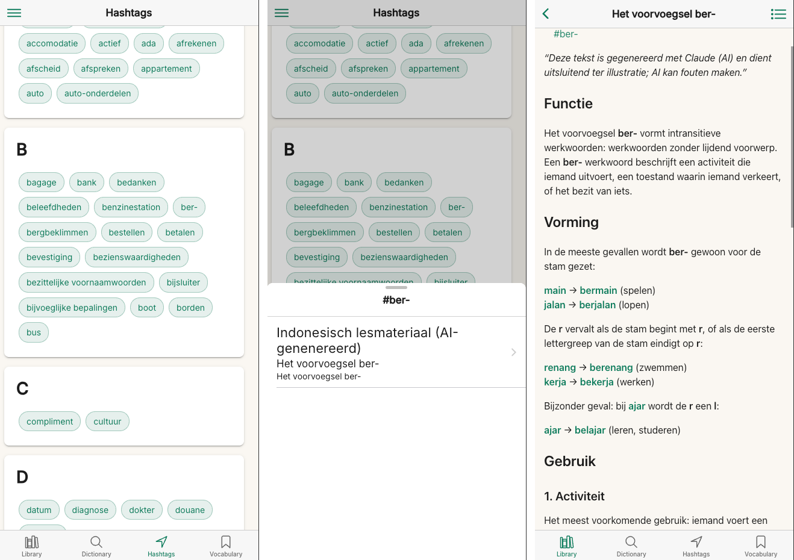

# Taalwiz: An Open-Source Indonesian-Dutch Language Learning Platform

**Repository:** https://github.com/remarcmij/taalwiz-mono  
**Contact:** Jim Cramer, remarcmij@gmail.com  

_Author's note: For a quick read I recommend the sections Overview, Dictionary and Library. All other sections are optional._

## Overview

Taalwiz began with a few things that came to mind while following courses in Indonesian at the Volksuniversiteit. What if I could access my learning materials and the Teeuw dictionary directly on my phone? I might still use the study books at home, but the paper dictionary could stay on its shelf. Next came the idea to connect the learning materials to the dictionary. What if I could tap a word while reading a lesson and see its meaning at once, without losing my place in the lesson? What if I could also use it on my laptop for serious study at home? That is the vision I, as a developer with the appropriate skills, started to build.

Taalwiz is the result: an open-source web application for learning Indonesian. At its heart is an interactive version of a dictionary. Any word can be looked up instantly, and the app resolves inflected and derived forms back to the right dictionary entry. A second major part is the Library, where publications containing bilingual articles (Indonesian-Dutch) can be browsed and read, and a finger tap on an Indonesian word immediately brings up a dictionary definition for that word.

The application is freely available under an open-source licence. Institutions can host it on infrastructure of their own choosing, adapt it to their content, and own their data entirely.

The dictionary forms the core of Taalwiz. It is currently set up to use the *Indonesisch-Nederlands Woordenboek* by A. Teeuw (Leiden: KITLV, 2009; ISBN 978-90-6718-100-6), which I digitised[^1] by hand[^2] from the print edition. 

The goal for the digitisation and the representation in the app was to reproduce as far as possible the way it looks in the printed version. The textual content is faithfully reproduced, as prof. Teeuw wrote it. No additions, deletions or alterations.

>Note that the dictionary content is not baked into the app itself. It is uploaded into the app's hosting environment once by the app administrator, using the app's admin functions.

Access to the app is currently restricted to a small private group, and the digitised dictionary is kept in a separate, private repository: the public open-source repository holds the software only, not the dictionary data.

In the next few sections the app's functionality will be described.

## Dictionary Tab - Search Dictionary

Figure 1 below shows the Dictionary tab and illustrates a typical dictionary search interaction. 

>Note that the app works on mobile phones, tablets and PCs. For the example illustrations in this document a mobile phone representation was chosen.

<small>Figure 1: *A typical dictionary search interaction, from suggestions to headword entry.*</small>

Here is a breakdown of Figure 1:

1. In the first panel the user typed _bera_ in the search field. A list of suggestions drops down and includes matching words from the dictionary. These include both Indonesian and Dutch words. Although the Teeuw dictionary is unidirectional, the app also indexes the Dutch glosses for each dictionary entry.

2. The second panel shows the search result after the user has tapped on the _berabang_ suggestion. The definition of the word _berabang_ is listed in the Teeuw dictionary under its headword _abang_. The button with the name of the headword (`ABANG`) can be tapped to bring up the full lemma of the headword, which includes the entry for _berabang_.

3. In the third panel the results are shown after the user tapped on the ABANG headword button. This effectively results in a new search, now for the word __abang__. Note that the search extends to other lemmas where the word __abang__ is referenced.

    The headword buttons for those other lemmas can again be tapped to go to their corresponding headword entries.

    At the top of the panel a history is shown of recent searches. Each word in the list can be tapped to initiate a new dictionary search for that word.

### Tap-to-Search

A key feature in Taalwiz is that every coloured word (i.e., all Indonesian words) can be tapped to initiate a dictionary search. This is illustrated in Figure 2.

<small>Figure 2: *Tap-to-Search*</small>

Breakdown:

1. In the first panel showing the search results for the word _abang_ the user tapped the word _cemara_. This brings up a panel that slides up from the bottom (a _bottom sheet_) with dictionary definitions for the word _cemara_. Tapping anywhere outside of the bottom sheet dismisses it.

    Through the magnifying glass a new search can be done for _cemara_. If the button is pressed, the bottom sheet is dismissed and the new search is initiated.

2. The second panel shows the results for the word _cemara_, resulting from tapping the magnifying glass.

### Reverse Lookup

In addition to searching for Indonesian words the app also supports searching for Dutch words in the Teeuw dictionary, i.e. a _reverse lookup_. By indexing the Dutch glosses of every lemma, the app offers a practical Dutch-to-Indonesian path on a dictionary that was only ever built to go the other way, something a printed unidirectional dictionary cannot do at all. A search for a Dutch word returns the lemmas in which it occurs. This is not a substitute for a true bidirectional dictionary, but in practice it is genuinely useful.

The reverse lookup is illustrated in Figure 3. Referring back to Figure 1, first panel, this the result of tapping on the _beraadslagen_ suggestion.

<small>Figure 3: *Reverse lookup for the Dutch word _beraadslagen_*</small>

What the figure shows is that the word _beraadslagen_ occurs in several Teeuw lemmas, sorted alphabetically on headword. Tapping a headword button, e.g. `BICARA` in the first block, initiates a search for that headword.

### Offline Use

The dictionary data is downloaded once, when the app is first installed; this can take up to a minute. After that the dictionary works without a network connection, for instance on a phone in flight mode or in an area with no coverage.

## Library Tab - Publications and Articles

Next to the dictionary, a major feature of the app is to browse through bilingual text content (Indonesian-Dutch) organised as publications, with each publication containing a list of articles. This content is typically created by a _content creator_ and uploaded by the admin to the app's hosting environment, using the app's admin functions.

The content organisation is illustrated in Figure 4.

<small>Figure 4: *The Library tab: publications and their articles.*</small>

>Note that the example publication shown here was generated with AI purely to illustrate the reading features; it is not curated study material. In a real deployment, an institution loads its own licensed content. This caveat concerns only the illustrative texts, not the Teeuw dictionary, which is reproduced faithfully.

### Tap-to-Search in Articles

Every Indonesian word in an article text is tappable, triggering a switch to the Dictionary tab and initiating a search for the tapped word. This is illustrated in Figure 5 below.

<small>Figure 5: *Tap-to-Search in an Article*</small>

In Figure 5, the word _terbesar_ was tapped. This word does not occur as a definition in the Teeuw dictionary. It only occurs in a gloss of the lemma for headword _bagi_. The search for _terbesar_ lands on its headword _besar_. This is accomplished through affix stripping as part of a search. The app handles a wide range of Indonesian affixes, including some subtleties of their ordering; this is detailed in Appendix I.

A word worth remembering can be saved to a personal vocabulary list with a second tap, keeping the example sentence it appeared in. The whole flow, from reading to lookup to saving, works offline once the content and dictionary have been downloaded: the app installs directly from the browser onto a phone, tablet, or computer (no app store required) and continues to work without an internet connection.

### Fill-in-the-blank exercises

A content creator can embed lightweight practice questions directly in an article by hiding an answer behind a blank. The learner taps the blank to reveal a single answer (recall), or, when several options are offered, taps the option they think is right and sees it confirmed in green or corrected in red. This reuses the same reading surface: ordinary words stay tappable for dictionary lookup, while the blanks respond independently. The authoring syntax (Markdown strikethrough) is described in the [Content Management Guide](./content-guide#fill-in-the-blank-quiz-blanks).

## Vocabulary Tab - Spaced Repetition

Words saved while reading can be reviewed later as flashcards using spaced repetition (the well-established SM-2 algorithm): cards a learner finds difficult come back sooner, well-known ones are spaced further into the future, with a simple Again / Good / Easy rating. A card carries the sentence the word was saved from, so it is reviewed in its original context, with each word in that sentence tappable for a quick lookup against the dictionary. This is what closes the loop the rest of the app opens: read a real text, look a word up, save it, and later retain it in the context it came from, rather than losing it once the lesson is over. A built-in practice mode lets a learner run through a list on demand without disturbing the review schedule.

Reading and the Teeuw dictionary remain the heart of Taalwiz; spaced repetition is the retention half that makes the vocabulary you meet there stick.

[^1]: The text is held as structured, plain Markdown, a form that lends itself to future correction, revision, or extension by editors or linguists.

[^2]: This was a substantial undertaking: over the course of several weeks I scanned the pages, corrected scanning errors, and marked up the Indonesian entries so that the app can recognise and link them.

## Appendix I - Handling Inflected Words

### How It Works

Rather than committing to a single canonical root, the app generates an ordered set of plausible base-form candidates and checks them against the on-device dictionary in sequence, stopping at the first match. The ordering is deliberate: the original form is tried first (in case it is indexed directly), followed by the most common active-voice forms (which the dictionary is most likely to contain), and finally stripped roots as a last resort.

**Example**: a learner taps _memperbaiki_ ("to repair"). The app peels the layers in turn (meN-, then per-, then the suffix -i) to reach the root _baik_, and shows the dictionary entry grouped under that headword. The ordering matters: per- is tried before the shorter pe-, which would otherwise mis-parse the word. (Figure 5 shows the same mechanism at work on _terbesar_ → _besar_.)

### Affixes Handled

The app strips a range of common affixes when generating candidate forms:

- Suffixes: -nya, -ku, -mu, -kan, -i, -an, -kah, -lah, -pun
- Prefixes: di-, ber-, ter-, se-, ke-, ku-, kau-, and the meN- and peN- families (mem-, men-, meny-, meng-, pem-, pen-, peny-, peng-)
- Circumfixes: ke-...-an, per-...-an, pe-...-an
- Reduplication, e.g. _anak-anak_ → _anak_

Stripping is recursive, so multi-affix words are reduced step by step. Where a prefix drops or assimilates the root's initial consonant (as in _memotong_, from _potong_), the app also generates restored candidates. It is a best-effort heuristic, not a full morphological analyser, and a small exemption list covers common words that do not follow the regular patterns. The morphological handling is mine to change, and I would gladly refine it on a linguist's advice.

## Appendix II - Hashtags and Connected Articles

Articles can carry hashtags that mark topics or themes. Each hashtag is a clickable link: tapping it opens an index of every article that shares the same tag, so related material is connected across the library rather than sitting in isolation. An article on cooking and one on markets might both carry the tag _food_, letting a reader move between them by topic. For a curated collection this turns a flat list of texts into a lightly cross-referenced web.

The Hashtags tab is shown in Figure 6.

<small>Figure 6: *Hashtags tab*</small>

Here is a breakdown of Figure 6:

1. The first panel shows the hashtags embedded in the articles, listed alphabetically.

2. In the second panel, a bottom sheet pops up after the user tapped the hashtag `ber-`. Since a hashtag can occur in more than one article, the bottom sheet lists the articles to choose from; here only one article carries the tag. Tapping a list item loads the corresponding article.

3. The third panel shows that article, positioned at the location of the hashtag.

## Appendix III - Technical Summary

| Component | Technology |
|---|---|
| Backend API | NestJS 11, MongoDB, JWT authentication |
| Web / mobile app | Angular 20, Ionic 8 |
| Offline support | Service Worker caching; full dictionary stored on device |
| Content format | Markdown |
| Deployment | Self-hosted; modest server requirements |
| Licence | MIT (permissive open source) |

Content, both reading articles and dictionary entries, is authored in Markdown. This means that subject-matter experts (linguists, course developers) can create and update content using familiar tools, without requiring software development skills for the authoring step itself.
