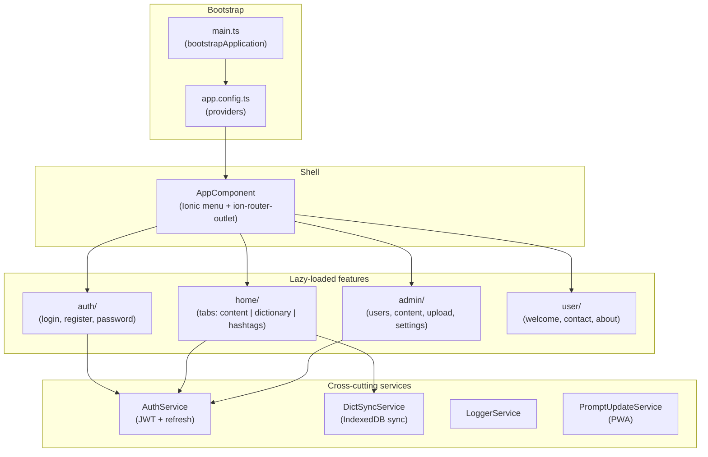
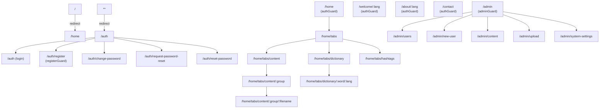
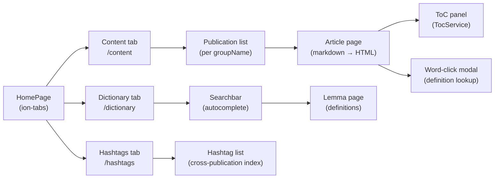
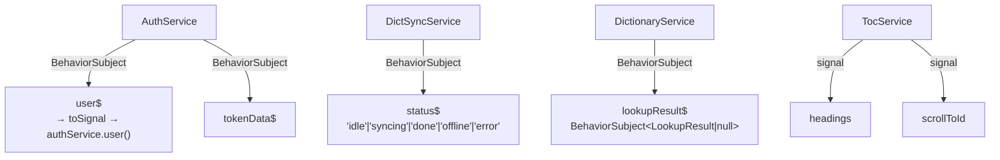
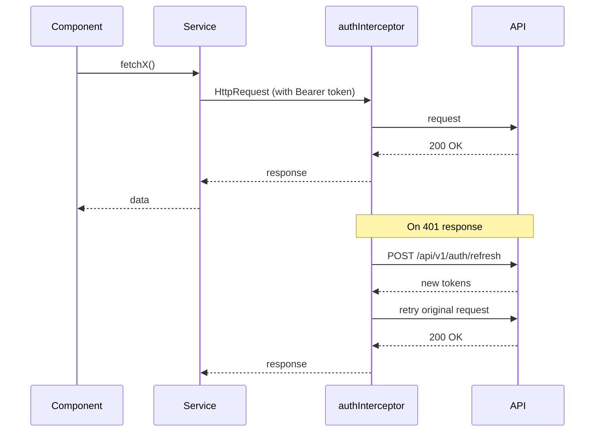
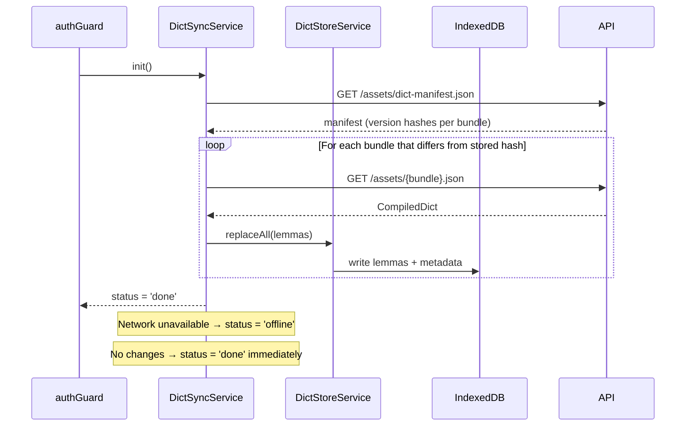
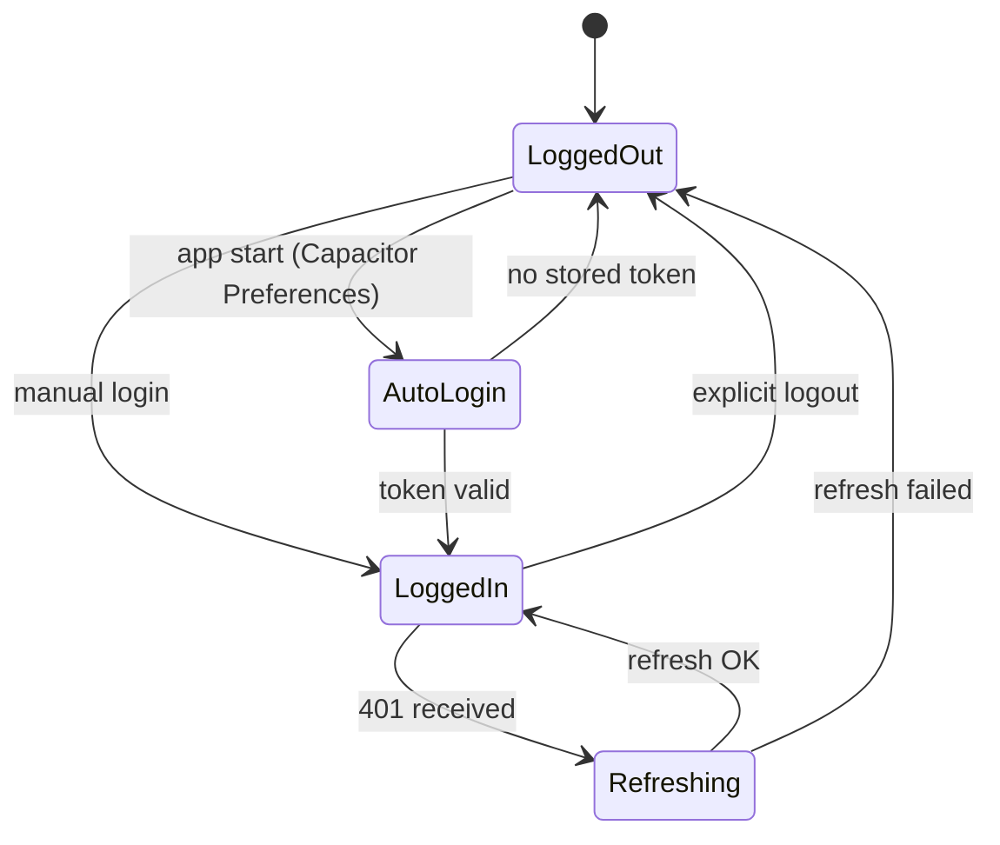
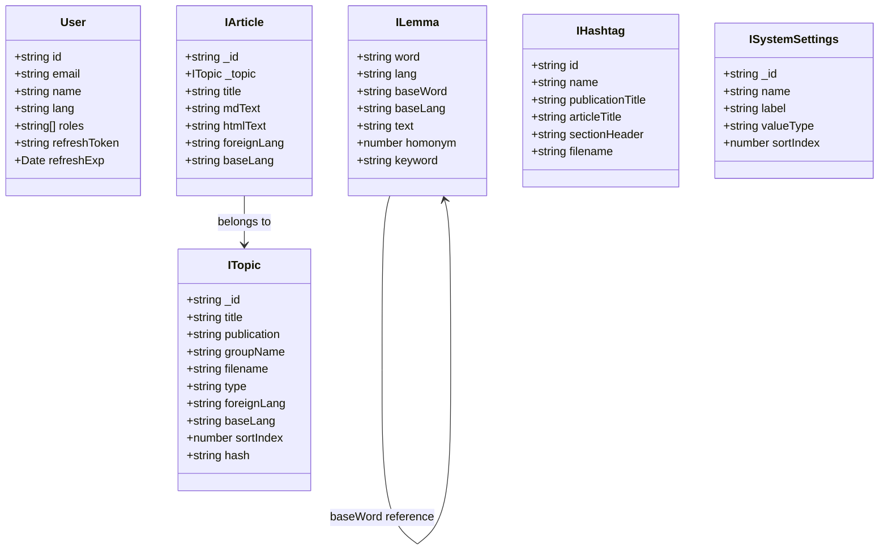

# taalwiz-web — Architecture

Angular 20 + Ionic 8 hybrid web/mobile app (Capacitor 7). Standalone components throughout — no NgModules. Zoneless change detection. Lazy-loaded feature routes.

## Table of Contents

1. [High-level overview](#1-high-level-overview)
2. [Folder structure](#2-folder-structure)
3. [Routing](#3-routing)
4. [Feature areas](#4-feature-areas)
5. [Services and state](#5-services-and-state)
6. [HTTP layer](#6-http-layer)
7. [Dictionary (offline-first)](#7-dictionary-offline-first)
8. [Authentication and security](#8-authentication-and-security)
9. [i18n](#9-i18n)
10. [Data models](#10-data-models)

---

## 1. High-level overview



---

## 2. Folder structure

```
src/app/
├── app.component.ts          # Root shell (Ionic side-menu + outlet)
├── app.routes.ts             # Top-level route table
├── app.constants.ts          # foreignLang = 'id'
│
├── auth/                     # Auth feature
│   ├── auth.service.ts
│   ├── auth.guard.ts
│   ├── admin.guard.ts
│   ├── auth.interceptor.ts
│   ├── user.model.ts
│   ├── auth.page.ts
│   ├── register/
│   ├── change-password/
│   ├── request-password-reset/
│   └── reset-password/
│
├── home/                     # Main tabbed feature
│   ├── home.page.ts          # Tab container
│   ├── speech-synthesizer.service.ts
│   ├── content/              # Content sub-feature
│   │   ├── content.service.ts
│   │   ├── markdown.service.ts
│   │   ├── topic.model.ts
│   │   ├── publication/
│   │   │   └── article/      # Article + ToC
│   │   └── hashtags/
│   └── dictionary/           # Dictionary sub-feature
│       ├── dictionary.service.ts
│       ├── dict-sync.service.ts
│       ├── dict-store.service.ts
│       ├── indonesian-stemmer.ts
│       ├── word-lang.model.ts
│       ├── searchbar/
│       └── lemma/
│
├── admin/                    # Admin feature (adminGuard)
│   ├── admin.service.ts
│   ├── users/
│   ├── content/
│   │   └── upload/
│   └── system-settings/
│
├── user/                     # Standalone user pages
│   ├── welcome/
│   └── contact/
│
├── about/
│
├── shared/                   # Non-feature utilities
│   ├── logger.service.ts
│   ├── api-error-alert.service.ts
│   ├── back-button/
│   └── word-click-modal/
│
└── sw-update/
    └── prompt-update.service.ts
```

---

## 3. Routing

All feature routes are lazy-loaded. The router uses `IonicRouteStrategy` (route reuse) and `PreloadAllModules`.



**Guards:**

| Guard | Purpose |
|---|---|
| `authGuard` | Requires authenticated user; triggers `DictSyncService.init()` |
| `adminGuard` | Requires `roles` includes `'admin'`; composes `authGuard` |
| `registerGuard` | Validates `?email=&token=` via API before showing register page |

---

## 4. Feature areas

### 4.1 Auth

Login, registration (invite-only with token), and password-reset flows. `AuthService` manages JWT state; all other features depend on it. On successful authentication the `authGuard` fires `DictSyncService.init()` so the local dictionary is ready before the user reaches the home tabs.

### 4.2 Home (tabs)

Three peer tabs sharing the same Ionic tab bar:



**Article flow:** `ArticleResolver` pre-fetches the article. `MarkdownService` converts `mdText` to HTML, wrapping foreign-language spans. Headings are extracted by `extract-headings.util.ts` and stored in `TocService`. Clicking a word opens `WordClickModalComponent` via `WordClickModalService`, which calls `DictionaryService` for lemma lookup.

### 4.3 Dictionary

Offline-first. On first load the dict manifest is fetched from `/assets/dict-manifest.json`; new or updated bundles are compiled and stored in IndexedDB (`taalwiz-dict`). `DictionaryService` wraps `DictStoreService` with Indonesian stemming for fuzzy lookup.

### 4.4 Admin

Protected by `adminGuard`. Covers user management (invite, list, delete), publication sort-order, file upload (`.md` / `.json` only — enforced client **and** server), and system settings (key/value store).

---

## 5. Services and state

### State management

There is no centralized store. Services own their state using RxJS `BehaviorSubject` or Angular signals:



`AuthService` exposes `user()` — a signal derived from `user$` via `toSignal()`. `AppComponent.currentUser` is a direct alias to this signal; there is no separate local copy. Components use `OnPush` change detection; zoneless change detection is enabled app-wide.

`DictionaryService.lookupResult$` is a `BehaviorSubject` (replays the last result to late subscribers). This matters because `WordClickModalComponent.dictionaryLookup()` navigates to the dictionary page and calls `lookup()` in the same tick — without replay, the result would be lost before `DictionaryPage` finishes rendering and subscribes.

### Service responsibilities

| Service | Location | Responsibility |
|---|---|---|
| `AuthService` | `auth/` | JWT + refresh-token management, login/logout, auto-login (Capacitor Preferences) |
| `DictSyncService` | `home/dictionary/` | Fetch manifest, download & compile dict bundles, write to IndexedDB |
| `DictStoreService` | `home/dictionary/` | IndexedDB CRUD wrapper (`taalwiz-dict` DB) |
| `DictionaryService` | `home/dictionary/` | Lookup with Indonesian stemmer, manage `lookupResult$` |
| `ContentService` | `home/content/` | Fetch publications & articles from API, in-memory cache |
| `MarkdownService` | `home/content/` | Markdown → HTML with foreign-language span injection |
| `TocService` | `home/content/…/article/` | Extract headings, scroll-to signal |
| `HashtagsService` | `home/content/hashtags/` | Hashtag index fetching |
| `SpeechSynthesizerService` | `home/` | Web Speech API wrapper (single word + full sentence) |
| `WordClickModalService` | `shared/` | Coordinate word taps → dictionary lookup → modal display |
| `ApiErrorAlertService` | `shared/` | Display Ionic alert on HTTP errors |
| `LoggerService` | `shared/` | Levelled logging (dev: `silly`, prod: `info`) |
| `PromptUpdateService` | `sw-update/` | PWA version-update detection and reload prompt |

---

## 6. HTTP layer



- All services call `authService.getRequestHeaders()` to attach `Authorization: Bearer <token>`. This is the sole API for obtaining an auth header — there is no secondary property equivalent.
- The `authInterceptor` handles 401s transparently: it invalidates the current token, calls the refresh endpoint, and retries the original request — or forces logout if refresh fails.
- Auth endpoints (`/api/v1/auth/*`) are excluded from the retry loop to prevent infinite recursion.
- API base paths: `/api/v1/` (user-facing), `/api/admin/` (admin endpoints), `/assets/` (static dict/content files).

---

## 7. Dictionary (offline-first)



`DictStoreService` opens the `taalwiz-dict` IndexedDB database with two stores: `lemmas` (indexed by `word:lang` and `word`) and `metadata` (stores manifest hashes for delta checking).

`DictionaryService` uses `IndonesianStemmer` to generate word variants (prefixes, suffixes) before calling `DictStoreService.findWordsStartingWith()`, so inflected forms resolve to the correct lemma.

---

## 8. Authentication and security



- **Token storage:** Access token in memory (JS ref); refresh token persisted via **Capacitor Preferences** (secure native storage on mobile; `localStorage` equivalent on web — see security note below).
- **Role-based access:** `roles: ('user' | 'admin' | 'demo')[]` on `User`. Admin routes require `'admin'` in the array; enforced in both `adminGuard` and the NestJS API.
- **Upload restriction:** Admin upload page accepts only `.md` and `.json` — enforced in the client `accept` prop **and** in `content.service.ts` server-side validation.
- **Server-side HTML sanitization:** `convertMarkdown()` in `apps/taalwiz-api/src/util/markup.ts` passes all Markdown-derived HTML through `sanitize-html` before storing or serving it. The allowlist covers only the tags and attributes the pipeline legitimately produces; `<script>`, event handlers, and `javascript:` URLs are stripped at the source.
- **`bypassSecurityTrustHtml`:** `ArticleBodyComponent` still calls `bypassSecurityTrustHtml()` on article HTML. This is acceptable because the HTML has already been sanitized server-side before it reaches the client.

> **Known open issue:** Refresh token is stored in Capacitor Preferences, which maps to `localStorage` on web — medium-severity risk. Mitigation (HttpOnly cookie) requires API changes and is not yet implemented.

---

## 9. i18n

Uses **ngx-translate**. Translation files are loaded at runtime from `/i18n/{lang}.json`.

| Setting | Value |
|---|---|
| Default UI language | Dutch (`nl`) |
| Fallback language | English (`en`) |
| Foreign (learning) language | Indonesian (`id`) — constant in `app.constants.ts` |

Language preference is persisted on the `User` model and applied via `TranslateService.use(user.lang)` on login.

---

## 10. Data models


