# web — Architecture

Angular 20 + Ionic 8 hybrid web/mobile app (Capacitor 7). Standalone components throughout — no NgModules. Zoneless change detection. Lazy-loaded feature routes.

## Table of Contents

1. [High-level overview](#1-high-level-overview)
2. [Folder structure](#2-folder-structure)
3. [Routing](#3-routing)
4. [Feature areas](#4-feature-areas)
5. [Services and state](#5-services-and-state)
6. [HTTP layer](#6-http-layer)
7. [Dictionary (offline-first)](#7-dictionary-offline-first)
8. [Content caching (service worker)](#8-content-caching-service-worker)
9. [Authentication and security](#9-authentication-and-security)
10. [Theming](#10-theming)
11. [i18n](#11-i18n)
12. [Data models](#12-data-models)

---

## 1. High-level overview

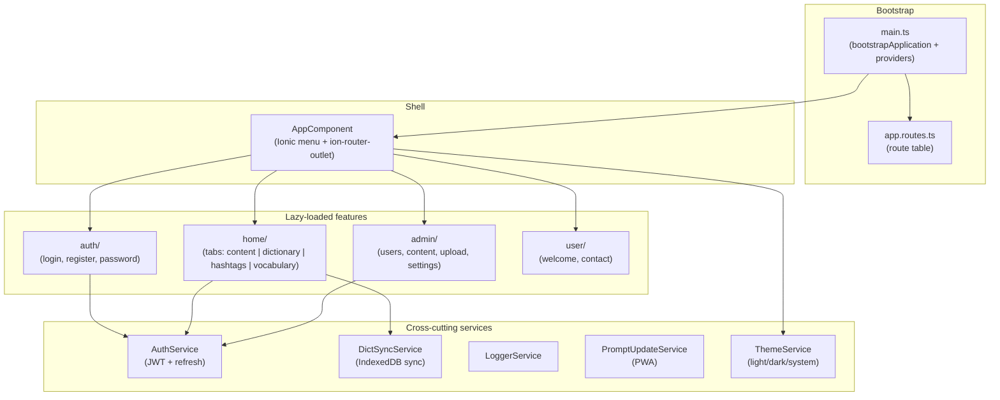

---

## 2. Folder structure

```
src/app/
├── app.component.ts          # Root shell (Ionic side-menu + outlet)
├── app.routes.ts             # Top-level route table
├── app.constants.ts          # langConfig (targetLang, nativeLang, stemmer)
│
├── auth/                     # Auth feature
│   ├── auth.service.ts
│   ├── auth.guard.ts
│   ├── admin.guard.ts
│   ├── auth.interceptor.ts
│   ├── user.model.ts
│   ├── auth.page.ts
│   ├── register/
│   ├── change-password/
│   ├── request-password-reset/
│   └── reset-password/
│
├── home/                     # Main tabbed feature
│   ├── home.page.ts          # Tab container
│   ├── speech-synthesizer.service.ts
│   ├── vocabulary/           # Vocabulary sub-feature
│   │   ├── vocabulary.service.ts
│   │   ├── vocabulary.page.ts
│   │   ├── vocabulary.page.html
│   │   ├── vocabulary.page.scss
│   │   └── vocabulary-entry-modal/   # Add / edit / CSV-import modal
│   │       ├── vocabulary-entry-modal.component.ts
│   │       ├── vocabulary-entry-modal.component.html
│   │       └── vocabulary-entry-modal.component.scss
│   ├── study/                # SRS flashcard sub-feature
│   │   ├── study.service.ts
│   │   └── study-modal/
│   │       ├── study-modal.component.ts
│   │       ├── study-modal.component.html
│   │       └── study-modal.component.scss
│   ├── content/              # Content sub-feature
│   │   ├── content.service.ts
│   │   ├── markdown.service.ts
│   │   ├── topic.model.ts
│   │   ├── publication/
│   │   │   └── article/      # Article + ToC
│   │   └── hashtags/
│   │       └── hashtag-modal/  # Occurrences list → article + scroll
│   └── dictionary/           # Dictionary sub-feature
│       ├── dictionary.service.ts
│       ├── dict-sync.service.ts        # spawns dict-import.worker
│       ├── dict-store.service.ts       # read-only IDB wrapper
│       ├── dict-db.ts                  # framework-free DB schema + transformDict
│       ├── dict-import.worker.ts       # off-main-thread atomic import
│       ├── search-history.service.ts
│       ├── indonesian-stemmer.ts  # implements Stemmer interface
│       ├── stemmer.ts             # Stemmer interface + IdentityStemmer fallback
│       ├── word-lang.model.ts
│       ├── history-modal/
│       ├── searchbar-dropdown/
│       └── lemma/
│
├── admin/                    # Admin feature (adminGuard)
│   ├── admin.service.ts
│   ├── users/
│   │   ├── new-user/         # Invite-new-user page
│   │   ├── groups-modal/     # Group assignment sheet modal
│   │   └── set-password-modal/  # Admin set-password sheet
│   ├── content/
│   │   └── upload/           # Drag/drop .md/.json + image upload
│   └── system-settings/
│
├── user/                     # Standalone user pages
│   ├── welcome/
│   └── contact/
│
├── about/                    # About modal (about-modal/), opened from the menu — not a route
│
├── help/                     # Help page (markdown, per user.lang)
│
├── settings/                 # Theme selector (light/dark/system)
│
├── shared/                   # Non-feature utilities
│   ├── logger.service.ts
│   ├── api-error-alert.service.ts
│   ├── theme/                # ThemeService (class-based dark palette)
│   ├── back-button/
│   └── word-click-modal/
│
└── sw-update/
    └── prompt-update.service.ts
```

---

## 3. Routing

All feature routes are lazy-loaded. The router uses `IonicRouteStrategy` (route reuse) and `NoPreloading` — the service worker already prefetches every lazy chunk, so router-level preloading would be redundant.

**Redirects**

- `/` → `/home`
- `**` → `/auth`

**Auth routes**

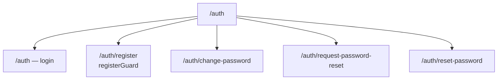

**Home tabs** (all require `authGuard`)

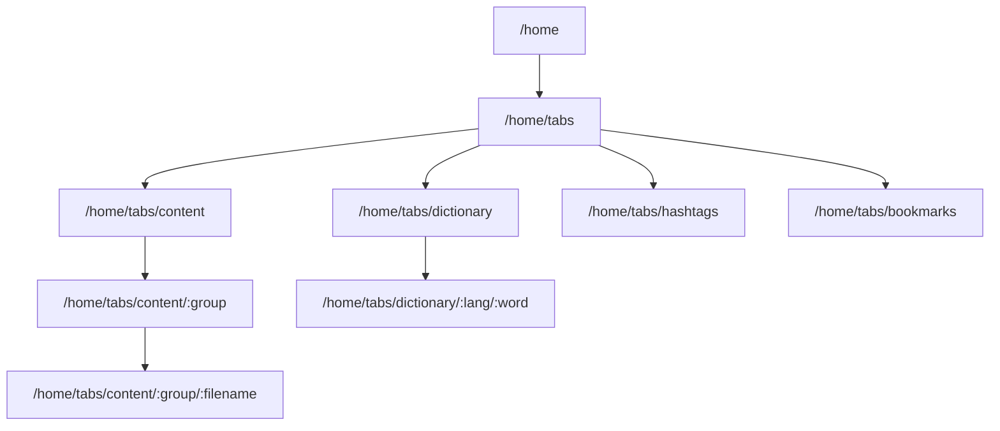

**Admin** (requires `adminGuard`)

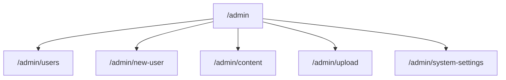

**Standalone pages** (all require `authGuard`)

- `/welcome/:lang`
- `/contact`
- `/help/:lang`
- `/settings`

(About is presented as a modal — `AboutModalComponent`, opened via the menu — not a route.)

**Guards:**

| Guard | Purpose |
|---|---|
| `authGuard` | Requires authenticated user; triggers `DictSyncService.init()` |
| `adminGuard` | Requires `roles` includes `'admin'`; composes `authGuard` |
| `registerGuard` | Validates `?email=&token=` via API before showing register page |

---

## 4. Feature areas

### 4.1 Auth

Login, registration (invite-only with token), and password-reset flows. `AuthService` manages JWT state; all other features depend on it. On successful authentication the `authGuard` fires `DictSyncService.init()` so the local dictionary is ready before the user reaches the home tabs.

### 4.2 Home (tabs)

Four peer tabs sharing the same Ionic tab bar:

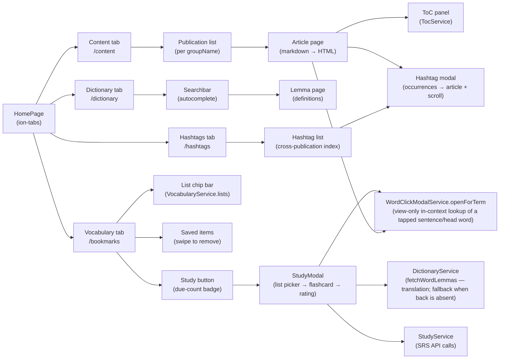

**Article flow:** `ArticleResolver` pre-fetches the article. `MarkdownService` converts `mdText` to HTML, wrapping foreign-language spans. Headings are extracted by `extract-headings.util.ts` and stored in `TocService`. Clicking a word opens `WordClickModalComponent` via `WordClickModalService`, which calls `DictionaryService` for lemma lookup.

**Hashtag flow:** Tapping a hashtag — either a `.hashtag` span inside an article or a chip on the Hashtags tab — opens `HashtagModalComponent`. It calls `HashtagsService.findHashtag()` to list every occurrence across publications; selecting one navigates to the target article and sets `TocService.scrollToId` so the page scrolls to the matching section.

### 4.3 Dictionary

Offline-first. On first load the dict manifest is fetched from `/assets/dict-manifest.json`; new or updated bundles are compiled and stored in IndexedDB (`taalwiz-dict`). `DictionaryService` wraps `DictStoreService` with pluggable stemming (via `langConfig.stemmer`) for fuzzy lookup — all searches run entirely offline against IndexedDB.

### 4.4 Admin

Protected by `adminGuard`. Covers user management (invite, list, delete, group assignment, suspend/reactivate, admin-set password), publication sort-order, hashtag reprocessing, file upload (`.md` / `.json` content plus `.jpg` / `.jpeg` / `.png` / `.gif` / `.webp` publication images — enforced client **and** server), and system settings (key/value store backed by the `SystemSettings` MongoDB collection, seeded on first API startup). The System Settings page uses an explicit Save/Cancel pattern: buttons appear in the toolbar only when `isDirty()` is true, driven by a `computed` signal that re-evaluates via `onSettingChange()` after each `[(ngModel)]` edit.

**Account actions:** The Users page exposes per-user actions beyond group management. **Suspend** toggles `User.isSuspended` via `PATCH /api/v1/users/:id/suspended`; a suspended user is blocked at the API. **Set password** opens `SetPasswordModalComponent` — a sheet with a password field (`IonInputPasswordToggle` eye toggle, min length from the shared `MIN_PASSWORD_LENGTH` constant) — and saves via `PATCH /api/v1/users/:id/password`.

**Group management:** The Users page shows each user's current groups as `IonChip` elements and provides an inline **Manage Groups** button. Tapping it opens `GroupsModalComponent` — a bottom sheet listing all available group names as checkboxes, populated from `GET /api/v1/content/groups`. Changes are saved via `PATCH /api/v1/users/:id/groups` and reflected immediately in the users list signal.

---

## 5. Services and state

### State management

There is no centralized store. Services own their state using RxJS `BehaviorSubject` or Angular signals:

**Auth**

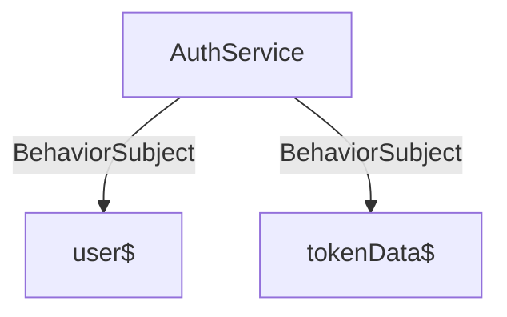

`user$` is exposed as `authService.user()` — a signal via `toSignal()`.

**Dictionary**

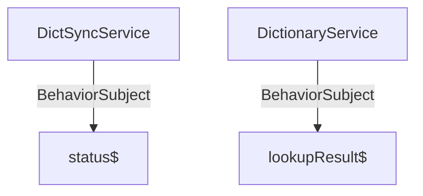

`status$` values: `'idle' | 'downloading' | 'importing' | 'done' | 'offline' | 'error'`. `DictSyncService` also exposes `hasCompleteDict$` (the version-based readiness flag — true iff `meta.version` is non-null) and an optional `progress$` for a determinate bar. `lookupResult$` type: `BehaviorSubject<LookupResult | null>`.

**Vocabulary & Study**

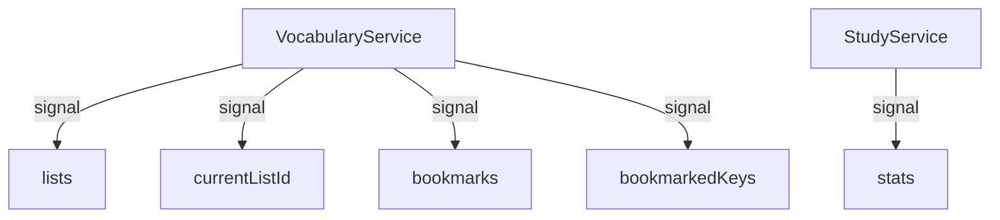

`lists`: `VocabularyList[]` with counts. `bookmarks`: `VocabularyEntry[]` for current list. `bookmarkedKeys`: `Set<string>` for O(1) lookup. `stats`: `SrsStatsEntry[]` per-list due/new/total.

**Content & Search**

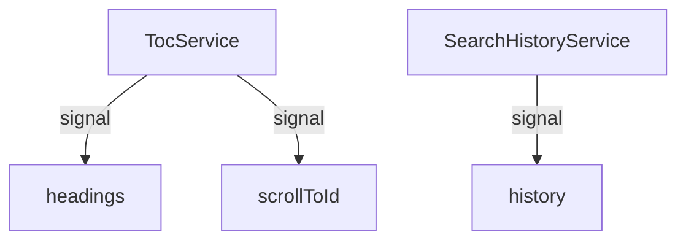

`history`: `HistoryEntry[]` newest-first.

`AuthService` exposes `user()` — a signal derived from `user$` via `toSignal()`. `AppComponent.currentUser` is a direct alias to this signal; there is no separate local copy. Components use `OnPush` change detection; zoneless change detection is enabled app-wide.

`DictionaryService.lookupResult$` is a `BehaviorSubject` (replays the last result to late subscribers). This matters because `WordClickModalComponent.dictionaryLookup()` navigates to the dictionary page and calls `lookup()` in the same tick — without replay, the result would be lost before `DictionaryPage` finishes rendering and subscribes.

### Service responsibilities

| Service | Location | Responsibility |
|---|---|---|
| `AuthService` | `auth/` | JWT + refresh-token management, login/logout, auto-login (Capacitor Preferences) |
| `VocabularyService` | `home/vocabulary/` | Named list management; vocabulary item add/remove/update with optimistic UI; `addEntry()`, `updateBack()`, `addEntries()` for modal-driven input; cross-device current-list sync via `UserPreferences` API; calls `StudyService.refreshStats()` after every add/remove |
| `StudyService` | `home/study/` | Reactive `stats` signal (per-list SRS counts); `getDueCards(listId)` and `submitReview()` observables for the SRS API |
| `DictSyncService` | `home/dictionary/` | Fetch manifest, compare versions on the main thread, spawn `dict-import.worker` for the actual import, re-emit worker progress/status, expose `hasCompleteDict$` readiness |
| `DictStoreService` | `home/dictionary/` | **Read-only** IndexedDB wrapper (`taalwiz-dict` DB): `open`, `getStoredVersion`, `findByWordAndLang`, `findWordsStartingWith`, `count`. All writes belong to `dict-import.worker.ts` |
| `DictionaryService` | `home/dictionary/` | Offline lookup via `DictStoreService` using `langConfig.stemmer` (pluggable); manages `lookupResult$` |
| `SearchHistoryService` | `home/dictionary/` | Persist search history (up to 50 entries) via Capacitor Preferences; deduplication on add |
| `ContentService` | `home/content/` | Fetch publications & articles from API; `prefetchArticle()` for silent bulk pre-fetch (publication cache-all button); manage SW content-cache invalidation (manifest check on login, explicit bust on admin mutations and logout) |
| `MarkdownService` | `home/content/` | Markdown → HTML with foreign-language span injection |
| `TocService` | `home/content/…/article/` | Extract headings, scroll-to signal |
| `HashtagsService` | `home/content/hashtags/` | Hashtag index fetching; `findHashtag()` lists occurrences for the hashtag modal |
| `SpeechSynthesizerService` | `home/` | Web Speech API wrapper (single word + full sentence) |
| `WordClickModalService` | `shared/` | Coordinate word taps → dictionary lookup → modal display; `onClicked()` for article DOM taps, `openForTerm()` for a known word (e.g. an SRS card) opening a view-only modal (bookmark/lookup actions hidden) |
| `ApiErrorAlertService` | `shared/` | Display Ionic alert on HTTP errors |
| `LoggerService` | `shared/` | Levelled logging (dev: `silly`, prod: `info`) |
| `PromptUpdateService` | `sw-update/` | PWA version-update detection and reload prompt |
| `ThemeService` | `shared/theme/` | Light/dark/system theme: persists choice in Capacitor Preferences, toggles the `ion-palette-dark` class on `<html>`, and (in `system` mode) tracks the OS `prefers-color-scheme` media query |

---

## 6. HTTP layer

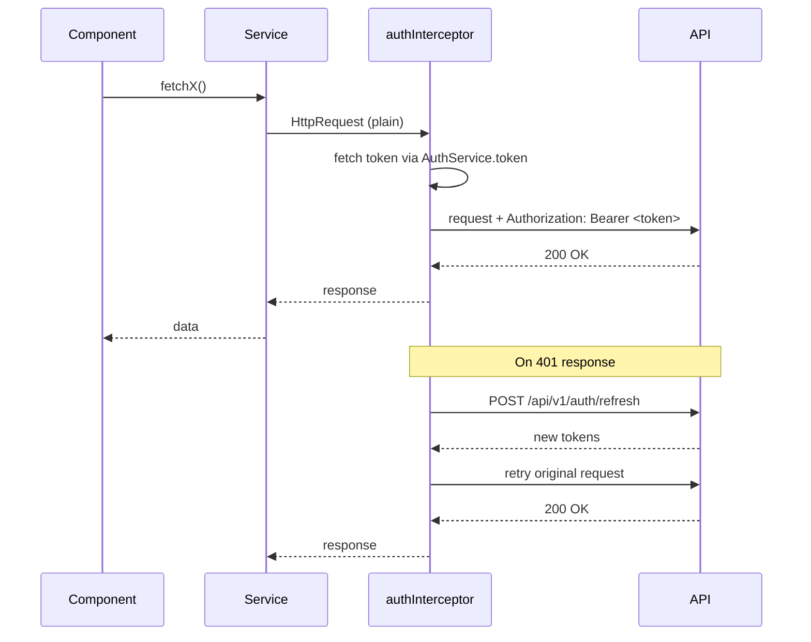

- The `authInterceptor` is the sole place that attaches `Authorization: Bearer <token>` to outgoing requests. Services and pages call `HttpClient` directly with no awareness of auth headers.
- Header attachment is scoped to `/api/v1/` URLs. Auth endpoints (`/api/v1/auth/*`) are skipped entirely — they're public, and routing `/auth/refresh` back through the interceptor would recurse via the token getter. Non-API traffic (i18n files, static assets) is also skipped.
- On a 401 the interceptor invalidates the current token, calls the refresh endpoint, and retries the original request once. If refresh fails the user is logged out.
- Concurrent refreshes are de-duplicated. `AuthService.token` checks the in-memory access token's expiry; when a refresh is needed it routes through `#getRefreshedToken()`, which caches a single in-flight `Observable` (`shareReplay` + `finalize` reset). Multiple requests that 401 at once therefore share one `POST /api/v1/auth/refresh` rather than each firing their own.
- API base paths: `/api/v1/` (all API endpoints, including admin), `/assets/` (static dict/content files). Admin-only routes sit under `/api/v1/admin/` and additionally require the `admin` role.

---

## 7. Dictionary (offline-first)

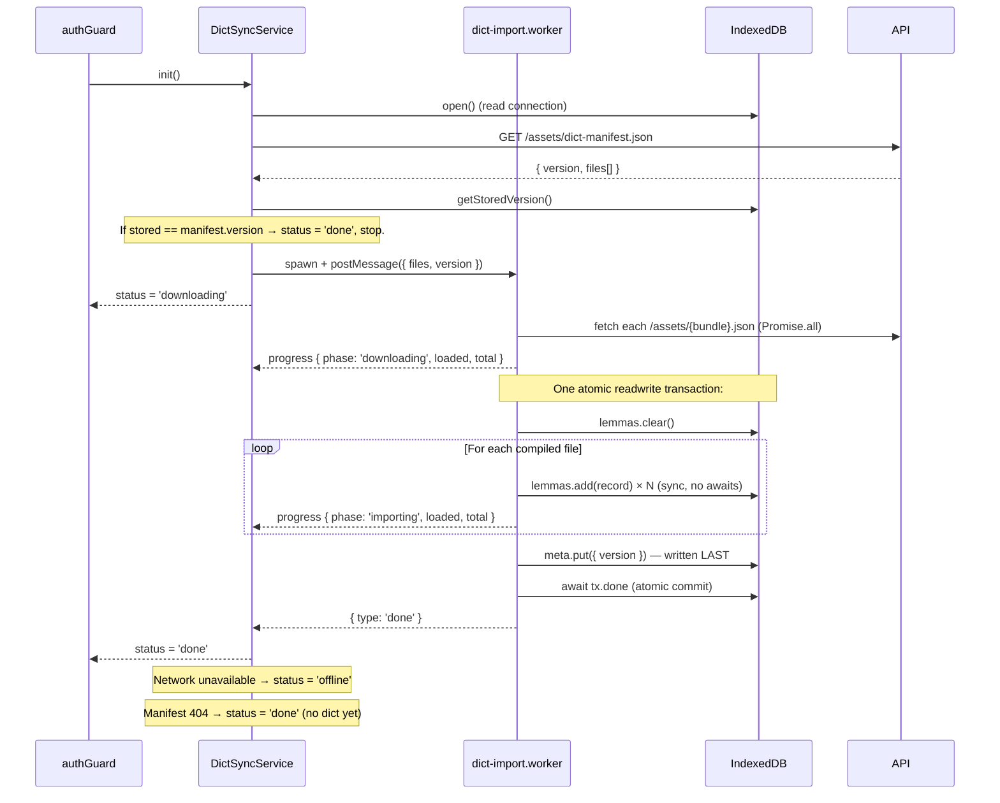

`DictStoreService` opens the `taalwiz-dict` IndexedDB database (version 4) for reads with two stores: `lemmas` (single index `by-lang-wordlower [lang, wordLower]` — language-scoped *and* case-insensitive; see [SEARCH.md](src/app/home/dictionary/SEARCH.md)) and `meta`. The `meta.version` record is the **atomic readiness flag**: written inside the worker's single import transaction *after* all `add()`s, so its presence (and equality with the manifest version) guarantees a complete dictionary is committed. A crash mid-import leaves no new version → next session re-syncs cleanly, with no half-built state ever observable.

#### Why a Web Worker

The compiled dictionary is ~270,000 word records. The import previously ran on the main thread as `clear()` + a synchronous loop of ~270k `store.add()` calls — that froze the UI for several seconds. Moving the import into a dedicated module worker (`dict-import.worker.ts`) achieves both responsiveness and consistency:

- **Off the main thread** — `fetch`, `JSON.parse`, `transformDict`, and the structured-clone work of every `add()` happen in the worker. The UI never blocks.
- **Single atomic transaction preserved** — the worker holds *one* readwrite transaction across the whole insert. All network fetches finish *before* the tx opens (awaiting a non-IDB promise inside an IDB transaction would auto-commit it early). Inside the tx the loop is fully synchronous; progress is reported with **synchronous `postMessage`** calls that don't yield control, so the tx stays open. IndexedDB isolation then guarantees readers see either the previous complete dictionary or the new one, never a partial state — no per-batch readiness gate needed.
- **Readiness signal** — `DictSyncService.hasCompleteDict$` is derived from `meta.version` (snapshotted on `init()` and set true after a successful worker import). The search bar is disabled only while syncing *and* no committed dict exists yet (first-ever build). During a re-sync the existing dictionary stays usable (atomic swap on commit).
- **Global chip** — a small "Updating dictionary X/Y" chip in `AppComponent` is visible from any route while `isSyncing()`, so background re-syncs aren't invisible outside the Dictionary tab. Tapping it jumps to the Dictionary tab. Driven by the same `status$` + `progress$` observables.
- **One DB, two connections** — main (read) + worker (write) at the same schema version → no `versionchange`, they coexist. A future schema bump would need to coordinate (main closes the read connection, lets the worker upgrade, reopens).

`DictionaryService` uses `langConfig.stemmer` (a pluggable `Stemmer` interface; currently `IndonesianStemmer`) to generate word variants before searching `DictStoreService`; inflected forms resolve to the correct lemma entirely offline.

---

## 8. Content caching (service worker)

Article bodies, topic index lists, and publication images are cached by the Angular service worker via three `dataGroups` in `ngsw-config.json`:

| Group | URL pattern | Strategy | maxSize | maxAge |
|---|---|---|---|---|
| `content-api-articles` | `/api/v1/content/article/**` | `freshness` (network-first, 3 s timeout) | 150 | 14 d |
| `content-api-index` | `/api/v1/content/**` | `freshness` (network-first, 3 s timeout) | 50 | 7 d |
| `publication-images` | `/assets/images/*.(jpg\|png)` | `performance` (cache-first, 10 s timeout) | 100 | 7 d |

The two `content-api` groups use `freshness` so online users always get responses validated by the API — important because content is access-controlled by group membership. The SW cache serves as an offline fallback only. The 14-day `maxAge` on articles means offline reading remains available for two weeks after the last online visit. Publication images are public static assets, so they use `performance` (cache-first) for instant rendering.

### Cache invalidation

`ContentService` manages three invalidation paths:

- **On login / app restart** — `user$` emits a non-null value. `ContentService` fetches `GET /api/v1/content/manifest` (`{ filename, sha }` per topic), serialises it, and compares with the previous manifest in `localStorage`. If any `sha` changed, both SW data caches are deleted so the next navigation fetches fresh content. First login just seeds the stored manifest.
- **On admin mutations** — Admin pages call `ContentService.clearCache()` after uploads, reorders, and deletions. This wipes both SW data caches immediately.
- **On logout** — `user$` emits `null`; `clearCache()` removes cached content from the browser's `CacheStorage`.

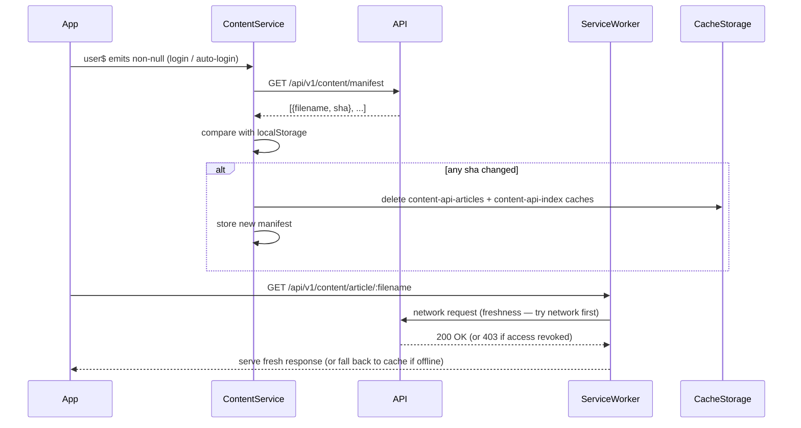

### Proactive caching

The publication topic-list page (`PublicationPage`) has a **cache-all** button in the toolbar's `end` slot. Tapping it calls `ContentService.prefetchArticle(filename)` for each article in the publication using RxJS `concat()` — one request at a time — so the SW caches all articles before the user opens any of them.

`prefetchArticle()` is a silent variant of `fetchArticle()`: it returns `Observable<boolean>` and swallows HTTP errors without calling `ApiErrorAlertService`. This prevents alert spam if one article fails during a bulk download.

`PublicationPage` drives the UI with two signals:

| Signal | Type | Description |
|---|---|---|
| `cacheStatus` | `'idle' \| 'caching' \| 'done'` | Button appearance and disabled state |
| `cachedCount` | `number` | Numerator for the deterministic `IonProgressBar` value |

Because articles use the `freshness` strategy, prefetching primes the SW cache so the articles are available offline; while online the SW still revalidates each one against the API (falling back to the cached copy only on network failure or the 3 s timeout).

---

## 9. Authentication and security

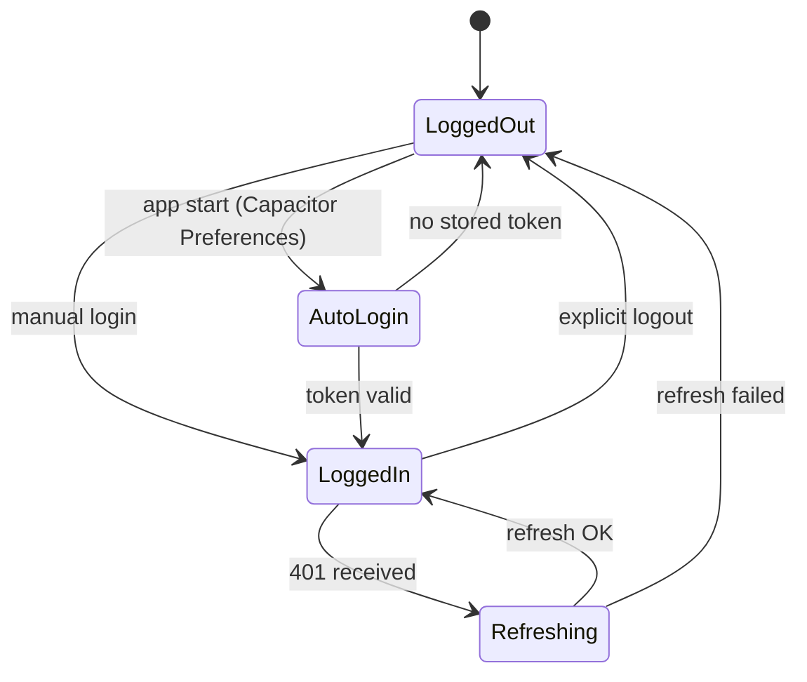

- **Token storage:** Access token in memory (JS ref); refresh token persisted via **Capacitor Preferences** (secure native storage on mobile; `localStorage` equivalent on web — see security note below).
- **Role-based access:** `roles: ('user' | 'admin' | 'demo')[]` on `User`. Admin routes require `'admin'` in the array; enforced in both `adminGuard` and the NestJS API.
- **Content group authorization:** `groups: string[]` on `User` controls which Library publications and hashtags are visible. Content tagged `groupName: 'public'` is visible to all authenticated users. Admin users bypass group filtering entirely. Groups are included in both the access token and refresh token; the admin UI allows assigning groups to users via `PATCH /api/v1/users/:id/groups`.
- **Upload restriction:** Admin upload page accepts `.md` / `.json` content files plus `.jpg` / `.jpeg` / `.png` / `.gif` / `.webp` publication images — enforced in the client (`ACCEPT_PATTERN` regex in `upload.page.ts`) **and** in the API's `content.service.ts` server-side validation. Images are written to `apps/api/public/assets/images/` and served at `/assets/images/`.
- **Server-side HTML sanitization:** `convertMarkdown()` in `apps/api/src/util/markup.ts` passes all Markdown-derived HTML through `sanitize-html` before storing or serving it. The allowlist covers only the tags and attributes the pipeline legitimately produces; `<script>`, event handlers, and `javascript:` URLs are stripped at the source.
- **`bypassSecurityTrustHtml`:** `ArticleBodyComponent` still calls `bypassSecurityTrustHtml()` on article HTML. This is acceptable because the HTML has already been sanitized server-side before it reaches the client.

> **Known open issue:** Refresh token is stored in Capacitor Preferences, which maps to `localStorage` on web — medium-severity risk. Mitigation (HttpOnly cookie) requires API changes and is not yet implemented.

---

## 10. Theming

The app ships a **teal** palette on a warm off-white background, with a class-based dark mode.

- **Palette:** `src/theme/variables.scss` sets `--ion-color-primary` to deep teal (`#0a7c5c`) and `--ion-background-color` to warm off-white (`#faf7f2`); cards stay white so they lift off the page. Body copy uses **Inter** (`--ion-font-family`); article/markdown content uses a system-UI stack (`--content-font-family`). Foreign-language spans render in the primary colour; a clicked word gets a teal underline (not a highlight). Hashtag spans use the primary tint.
- **Dark mode mechanism:** `global.scss` imports Ionic's **`dark.class.css`** palette (not `dark.system.css`), so dark mode is driven entirely by the `ion-palette-dark` class on `<html>` rather than the OS media query. `variables.scss` / `global.scss` override the dark background to a neutral `#121212` and bump shadow opacity.
- **`ThemeService`** (`shared/theme/`) owns the choice. `theme` is a signal of `'system' | 'light' | 'dark'`, persisted under the `app.theme` key via Capacitor Preferences (→ `localStorage` on web). `setTheme()` writes the preference and calls `#apply()`, which adds/removes the `ion-palette-dark` class. In `system` mode it mirrors `prefers-color-scheme: dark` and attaches a `change` listener (torn down whenever the mode changes). The default is **light**.
- **Settings page** (`/settings`, `authGuard`) is a thin `IonRadioGroup` over `ThemeService.theme`; selecting an option calls `setTheme()`.
- **Modal uniformity:** a global `ion-modal` rule pins `--background` and the Ionic source theme variables to `--ion-card-background` so every modal surface (including `ion-content`'s shadow background div) resolves to the same colour in both palettes.
- **Markdown override:** `github-markdown-css` carries its own `@media (prefers-color-scheme: dark)` block; `.markdown-body` is forced to `background: transparent` and `color: var(--ion-text-color)` so article text follows the class-based theme instead of the OS preference.

---

## 11. i18n

Uses **ngx-translate**. Translation files are loaded at runtime from `/i18n/{lang}.json`.

| Setting | Value |
|---|---|
| Default UI language | Dutch (`nl`) |
| Fallback language | English (`en`) |
| Target (learning) language | Indonesian (`id`) — `langConfig.targetLang` in `app.constants.ts` |

`LanguageService` (`shared/i18n/language.service.ts`) owns the runtime locale. The server-side `user.lang` field is the source of truth and drives both the ngx-translate locale and the language-scoped Help/About routes.

- On boot, `LanguageService.init()` runs as an `APP_INITIALIZER` and applies the value cached in Capacitor `Preferences` (key `app.lang`) so pre-login screens render in the last-used language.
- `LanguageService` subscribes to `AuthService.user$`; when a user emits, `user.lang` is applied — the server always overrides the local cache on login.
- The Settings page calls `LanguageService.setLanguage(lang)`, which `PATCH`es `/api/v1/users/me/lang`, applies the new locale, then calls `AuthService.applyLangToCurrentUser(lang)` to update the in-memory `User` and re-persist the cached `authData` so the language-dependent `/help/{lang}` menu link updates reactively and survives an `autoLogin`.
- A change on one device only reaches another device at the next *full* login — the refresh-token endpoint does not fetch the profile.

---

## 12. Data models

**Auth**

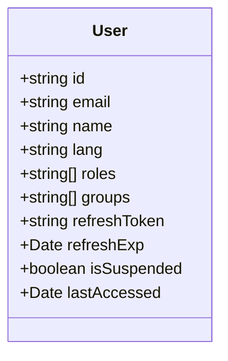

**Content**

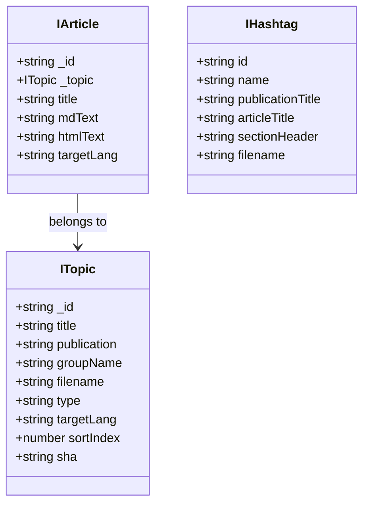

**Dictionary**

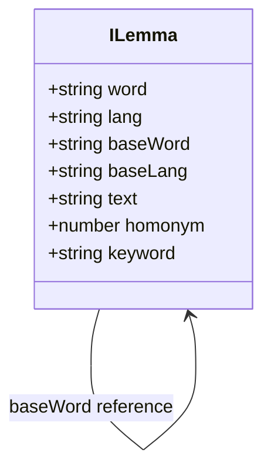

**Vocabulary & Study**

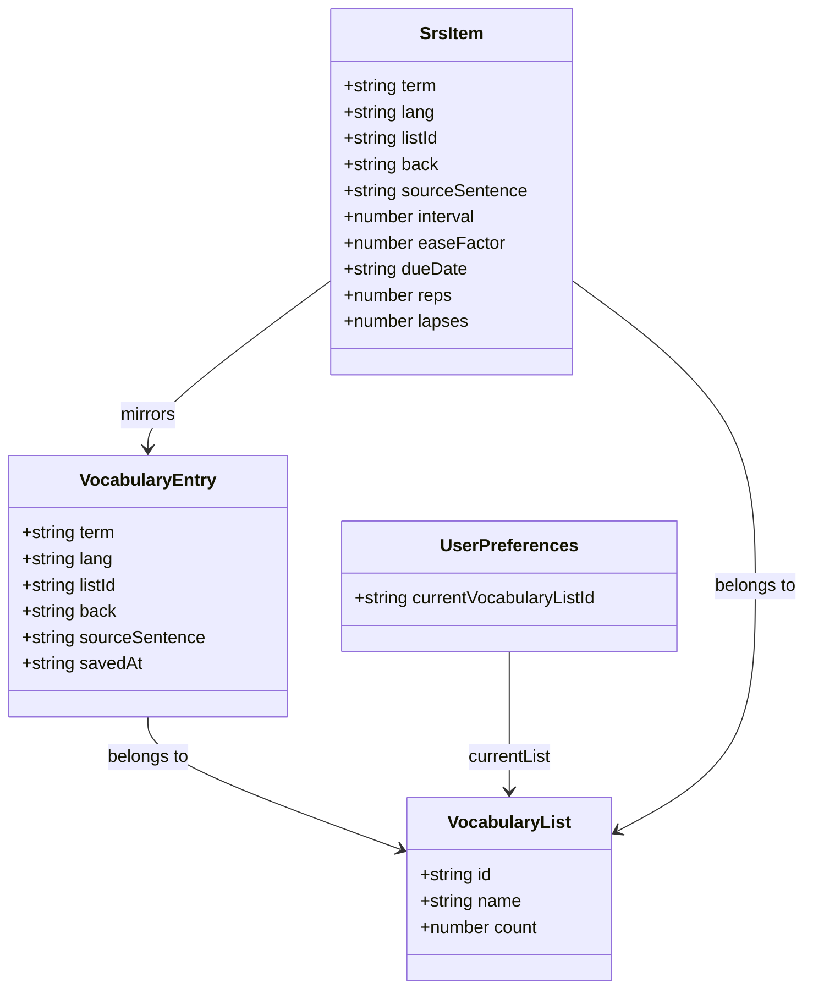

**Admin**

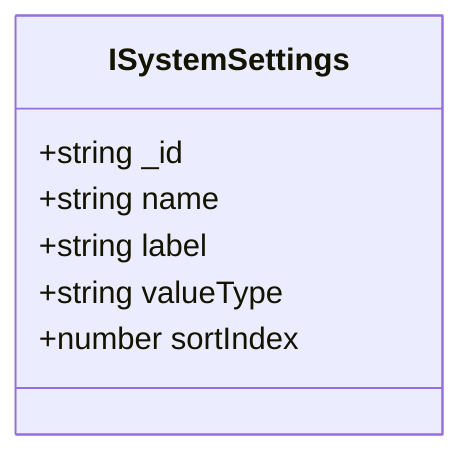
